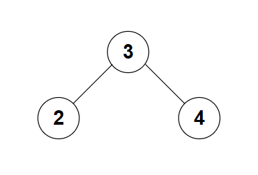
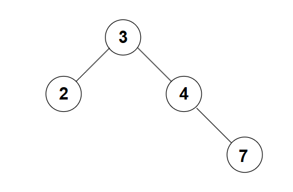
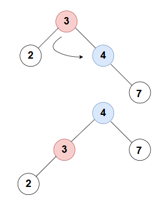
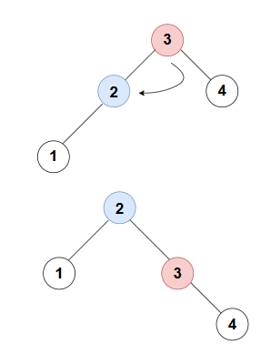
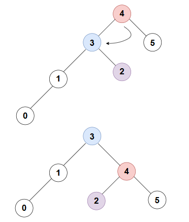

# 二叉平衡树（又称 AVL 树）

AVL 树是一种基于二叉搜索树的树，有自平衡的特点

## 何为平衡

在这之前，我们先引入平衡因子的概念：

---

### 平衡因子

对于二叉树的任意一个节点，平衡因子（此处记为 $b$）为：

$$
b = Height(T_{left}) - Height(T_{right})
$$

其中，$Height$ 代表取一个节点在这个树中的高度，$T$代表当前节点，下标 $_{left}$代表是当前节点的左节点，$_{right}$同理

---

介绍完平衡因子后，也就能够知道这里的“平衡”指的是什么了：

对于 AVL 树中的任何一个节点，平衡因子最大为 1

## 实现

### 高度代码处理

由于平衡因子是自行计算出来得到，而这个计算依赖与节点的高度属性，因此我们先处理关于高度的代码：

```c++
void updateHeight() {
    int lh = getHeight(left);
    int rh = getHeight(right);
    height = 1 + (lh > rh ? lh : rh);
}
```

在进行过插入等操作后，不可避免地会更改高度，因此我们需要上面的这个方法来实时更新当前节点的高度属性

同时，也就需要一个接口供我们访问这个属性

```c++
static int getHeight(AVLNode* node) {
    return node ? node->height : -1;
}
```

### 平衡因子计算

之后，我们需要有一个方法来计算当前节点的平衡因子以便后续处理：

```c++
static int getBF(AVLNode* node) {
    return node ? getHeight(node->left) - getHeight(node->right) : 0;
}
```

接下来，我们便要进行传统的增删查改环节了

但是在这之前，我们需要思考：当我们对 AVL 树进行插入和删除操作的时候，必定会对树的高度有所影响


_正常的 AVL 树_

但是，由于 AVL 树遵循二叉搜索树的性质，所以我们的这个 AVL 树不可避免的会有**不平衡**的情况出现


_插入元素 7 后的的 AVL 树（不合法）_

这个时候我们就需要通过一些操作将树进行平衡。这个操作便是树的旋转

## 树的旋转

### 何为旋转

树的旋转便是为了解决上述平衡问题而存在的操作

旋转，分为左旋转和右旋转

每种旋转的本质便是将当前节点作为轴，向左（逆时针）或者向右（顺时针）进行旋转


_左旋_


_左旋_

加以观察，你会发现旋转前和旋转后的树的中序遍历其实是一样的，换言之，旋转并没有使树改变

如果遇到了旋转部分存在一个子节点的情况时，就让旋转节点的左（右）节点等于这个冲突的节点，举个例子：


_冲突解决的例子_

注意到紫色的节点 2 为冲突节点，那么在节点 4 旋转的时候就将这个冲突的节点接在了旋转节点 4 的左节点上

### LL,LR,RR,RL 四种类型

所谓上述的四种类型，便是四种常见的使 VAL 树不平衡的情况

其中，对于 LL 情况我们已经见过了，便是刚刚的那个例子：


_LL_

事实上，这四种类型的称呼来源于根节点和最大高度子节点的平衡因子情况

- 1 LL：根结点的平衡因子 +2，左子树根结点平衡因子 +1；

- 2 RR：根结点的平衡因子 -2，右子树根结点平衡因子 -1；

- 3 LR：根结点的平衡因子 +2，左子树根结点平衡因子 -1；

- 4 RL：根结点的平衡因子 -2，右子树根结点平衡因子 +1；

因此，我们可以写出下面的函数来实现左旋转和右旋转：

```c++
static AVLNode* RRotate(AVLNode* y) {
    if (!y || !y->left) return y;
    AVLNode* x = y->left;
    AVLNode* T2 = x->right;

    x->right = y;
    y->left = T2;

    y->updateHeight();
    x->updateHeight();

    return x;
}

static AVLNode* LRotate(AVLNode* x) {
    if (!x || !x->right) return x;
    AVLNode* y = x->right;
    AVLNode* T2 = y->left;

    y->left = x;
    x->right = T2;

    x->updateHeight();
    y->updateHeight();

    return y;
}
```

同时，需要一个 balance 函数来进行自动的平衡：

```c++
static AVLNode* balance(AVLNode* node) {
    if (!node) return nullptr;

    node->updateHeight();
    int bf = getBF(node);

    if (bf > 1) {
        if (getBF(node->left) < 0) {
            node->left = LRotate(node->left);
        }
        return RRotate(node);
    }

    if (bf < -1) {
        if (getBF(node->right) > 0) {
            node->right = RRotate(node->right);
        }
        return LRotate(node);
    }
    return node;
}
```

完成平衡相关的代码后，我们便可以开始写增删查改的代码了

## 插入

```c++
static AVLNode* insert(AVLNode* node, int d) {
    if (!node) return new AVLNode(d);

    if (d < node->data) {
        node->left = insert(node->left, d);
    }
    else if (d > node->data) {
        node->right = insert(node->right, d);
    }
    else {
        return node;
    }

    return balance(node);
}
```

## 删除

```c++
static AVLNode* del(AVLNode* node, int d) {
    if (!node) return nullptr;

    if (d < node->data) {
        node->left = del(node->left, d);
    }
    else if (d > node->data) {
        node->right = del(node->right, d);
    }
    else {
        if (!node->left || !node->right) {
            AVLNode* temp = node->left ? node->left : node->right;
            if (!temp) {
                delete node;
                return nullptr;
            } else {
                AVLNode* toReturn = temp;
                delete node;
                return balance(toReturn);
            }
        } else {
            AVLNode* temp = findMin(node->right);
            node->data = temp->data;
            node->right = del(node->right, temp->data);
        }
    }

    return balance(node);
}
```

> [!WARNING]
> 上述操作都需要注意，由于插入和删除操作都对树进行了节点的增删，所以平衡有可能会被打破，这个时候需要调用 `balance` 方法来维持平衡

## 查找

```c++
bool has(int d) {
    if (d == data) return true;
    if (d < data) return left ? left->has(d) : false;
    return right ? right->has(d) : false;
}
```

## 修改

逻辑与查找类似，需要增加赋值的逻辑，不多赘述
