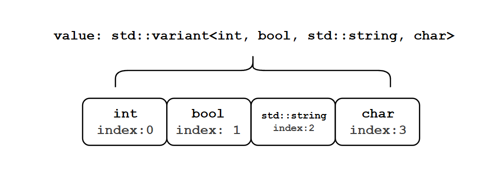

# C++标准库学习：variant

## 概述
`std::variant` 自C++17开始被引入，本质是一个联合体（Union）

但是相比原先的联合体，它类型安全方面做得更好

它的签名如下：
```c++
template<class... Types>
class variant
```

`std::variant` 的作用也很简单，在一个对象中储存给定类型范围的类型的值；这样做，基本上不需要担心 `std::any` 带来的类型安全问题。

## 使用
你可以通过下面的方式声明一个 `std::variant<class... Types>`：
```c++
std::variant<int, bool, std::string, char> value;
```
通过上述的声明，现在 `value` 可以存储 `int`, `bool`, `std::string` 或 `char` 类型的值（四者取其一）

如果想给这个 `value` 赋值，直接写即可

例如，我想对他赋值 `true`：
```c++
value = true;
```
那么，问题来了，如何判断当前的 `value` 存储的是哪个类型的值呢，如果判断出来了，又该如何访问到这个值呢？
### 相关方法

#### `std::holds_alternative`
`std::holds_alternative` 方法便是用来解决上面的第一个问题，即：判断一个 variant 存储的是哪个类型的值

方法签名如下：
```c++
template<typename _Tp, typename... _Types>
constexpr bool holds_alternative(const variant<_Types...>& __v) noexcept
```
其中，`_Tp` 是我们在使用的时候真正需要关心的模板参数，他的含义是判断当前 variant 是否存储 `_Tp` 类型的值

因此，如果我们想要检查当前value是否为bool类型：
```c++
std::holds_alternative<bool>(value)
```
对于给出的情景（`value = true;`），这个表达式当然是返回 `true` 了

#### `std::get`
`std::get` 方法用于获取给定的 variant 的值，它的签名如下：
```c++
template<typename _Tp, typename... _Types>
constexpr _Tp& get(variant<_Types...>& __v)

template<typename _Tp, typename... _Types>
constexpr _Tp&& get(variant<_Types...>&& __v)
```
*注：`std::variant` 的 `std::get` 有四个版本，这里只列出非const的版本*

上述方法分别对应左值引用的版本和右值引用的版本，对于我们现在所讨论的主题，我们不需要关心这其中的细节，我们需要关心的仍然是 `_Tp`，
他代表我们期望从给出的 variant 中获得 `_Tp` 类型的值

当然，其实也可以用另一种 `std::get` 的方式：
```c++
template< size_t I, typename... Types >
constexpr variant_alternative_t<I, variant<Types...>>& get( variant<Types...>& v );

template< size_t I, typename... Types >
constexpr variant_alternative_t<I, variant<Types...>>&& get( variant<Types...>&& v );
```
*注：这里只列出非const的版本*

上述方法的含义是在 variant 中根据给定的索引获得对应的元素

要理解这种访问方法，我们先需要知道对于 `std::variant` 何谈索引一说？

事实上，在你声明一个 `std::variant` 对象的时候，这个索引从0到1按照你给定的类型顺序进行排列

那么，对于上述的例子，我们可以用下图解释：



也就是说，下面两种访问方式是等价的：
```c++
std::get<bool>(value);
std::get<1>(value);
```

但当我们get的类型不是当前 variant 存储的类型的话，会抛出 `std::bad_variant_access` 异常；但是，很多情况我们无法确定这个 variant 存储的是什么类型的值

那么，在使用 `std::get` 之前，我们必须要先进行检查，也就是调用 `std::holds_alternative` 方法，但是这样会非常繁琐

因此，我们可以使用更加方便的 `std::visit` 方法
#### `std::visit`
该方法签名如下：
```c++
template<typename _Visitor, typename... _Variants>
    constexpr __detail::__variant::__visit_result_t<_Visitor, _Variants...>
    visit(_Visitor&& __visitor, _Variants&&... __variants)
```
它拥有两个参数，签名分别是 `_Visitor&& __visitor` 和 `_Variants&&... __variants`

`_Visitor&& __visitor` 是一个可调用的对象（函数，Lambda，或者是伪函数之类的），它用于对给定的 variant 进行处理；同时，它的返回值也就是这个方法的返回值

`_Variants&&... __variants` 是一系列 variant，他们会被放置到对应的 visitor 的参数中去

例如，给出下面的例子：
```c++
auto visitor = [](auto&& arg) {
    if constexpr (std::is_same_v<std::decay_t<decltype(arg)>, int>) {
        std::cout << "Integer: " << arg << std::endl;
        return 0;
    } else if constexpr (std::is_same_v<std::decay_t<decltype(arg)>, std::string>) {
        std::cout << "String: " << arg << std::endl;
        return arg.length();
    } else {
        return -1;
    }
};

std::variant<int, std::string> v = "Hello World";

size_t length = std::visit(visitor, v);
```
我们便通过我们给出的 visitor 对一个 variant 进行判定并获得对应的值

值得注意的是，由于我们并不知道这个 variant 的具体签名，所以我们使用 `auto` 关键字进行

### 默认构造
如果我们没有对一个 variant 进行初始化而只是声明，这个 variant 应该持有什么类型的值？

答案是，类型参数的第一个类型

按照 variant 的实现，当没有对一个 variant 实例初始化时，会用给出的类型参数的第一个类型对这个 variant 进行初始化

但是，这个初始化存在一个重要的前提：**这个类型必须是默认可构造的**

因此，当使用一个没有默认构造函数的类型的时候，无法对一个 variant 进行默认初始化

### 空值：`std::monostate`
当我们想表示一个 variant 中无值的时候，可以使用 `std::monostate`：
```c++
std::variant<std::monostate, bool, int> value;
```