# Linux命令基本操作

使用Linux时，不可避免地会使用到Linux的终端，因此我们需要对其中的命令进行熟悉，尤其是那些常用的命令
因此，本篇对常用的命令进行了收集和说明

### 1. `cat`  命令
cat命令作用是查看文件内容，格式为：
```
cat [file-name]
```
**使用效果：**

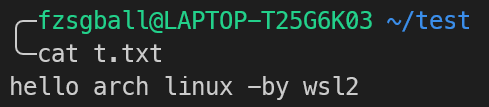

其它用法： 
#### 1.
```
cat [file-1] [file-2] ... > [file-n]
```
将file-1，-2，.....的内容连接起来，再写入文件file-n中
```
举个例子，假如有文件file-1，file-2，file-3
其中file-1内容为一个数字1，file-2内容为数字2，file-3内容为数字3

[input]           : cat file-1 file-2 > file-3
[file-3 content]  : 12
```
**使用效果：**

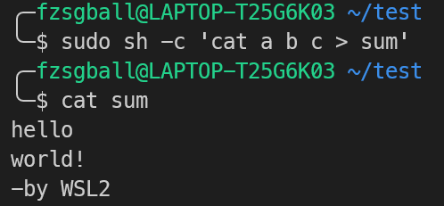


#### 2.
```
cat [file-1] [file-2] ... >> [file-n]
```
将file-1，-2，.....的内容连接起来，再 ****以追加的方式**** 写入文件file-n中
```
举个例子:

[input]           : cat file-1 file-2 >> file-3
[file-3 content]  : 312
```

> [!WARNING]
> 在使用上述命令时，应该以如下方式使用 (以第一个为例):
> ```
> sudo sh -c 'cat [file-1] [file-2] ... > [file-n]'
> ```
> 这个问题的原因是因为重定向 `> [file-n]` 的操作并不是由sudo执行而是shell，使用的是普通用户的权限
> 因此使用了sudo的指令只有前半段 `cat [file-1] [file-2] ...`，于是导致了问题的出现

### 2. `touch` 命令
touch命令作用是创建文件，格式为:
```
touch [file-1] [file-2] ...
```
运行后，系统会创建以touch命令之后的字段为名的文件

**使用效果：**

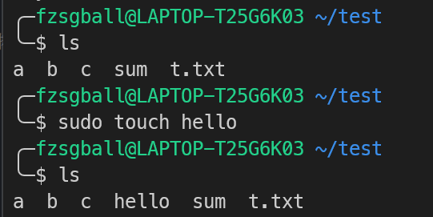

### 3. `file` 命令
file命令用于确定对应文件的文件类型，在没有文件拓展名的情况下依然适用: 
```
file [file-name]
```

**使用效果：**

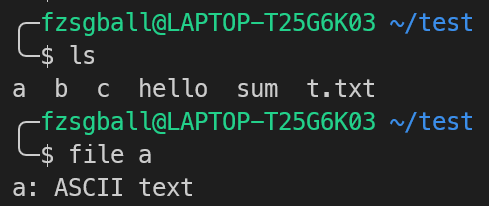

### 4. `cd` 命令
cd命令用于更改当前工作目录

**使用效果：**

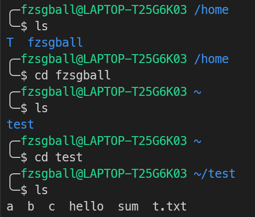

### 5. `pwd` 命令
该命令用于输出当前的工作目录

**使用效果：**

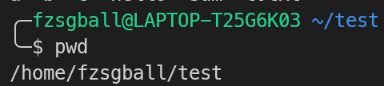

### 6. `mkdir` 命令
该命令用于在当前工作目录下创建一个目录

**使用效果：**

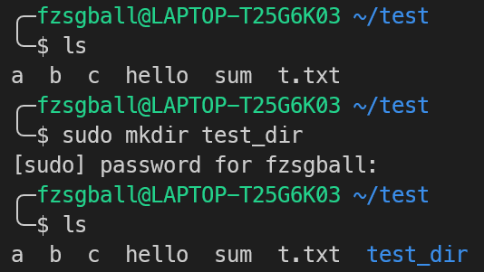

#### 参数（参数支持组合）：

`-p`：该用法可以创建多级目录，即使父目录不在的情况下也能创建

**使用效果：**

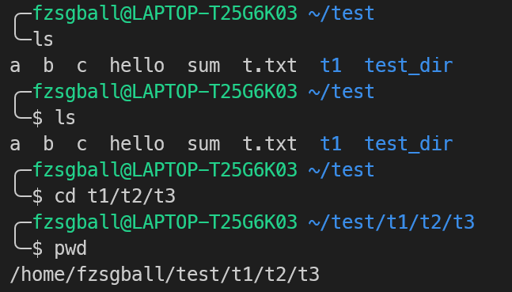

`-v`：该用法可以在创建目录的时候输出对应信息

**使用效果：**

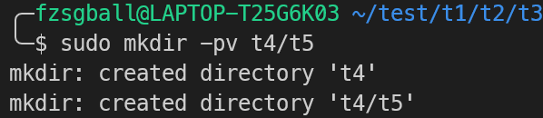

### 7. `rmdir` 命令
rmdir只能用于用于删除空的目录

**使用效果：**

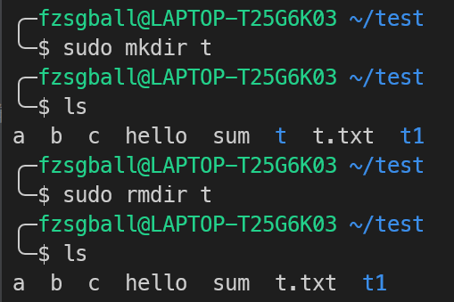

而当你尝试用rmdir删除一个非空目录的时候，会报错：

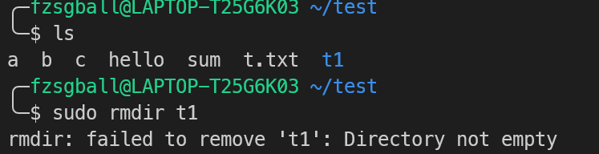

***其中，t1是我们先前用于演示 mkdir -p 时的产物（t1里面还有其他目录）***

### 8. `stat` 命令
该命令用于显示文件或者文件系统的详细信息

**使用效果：**

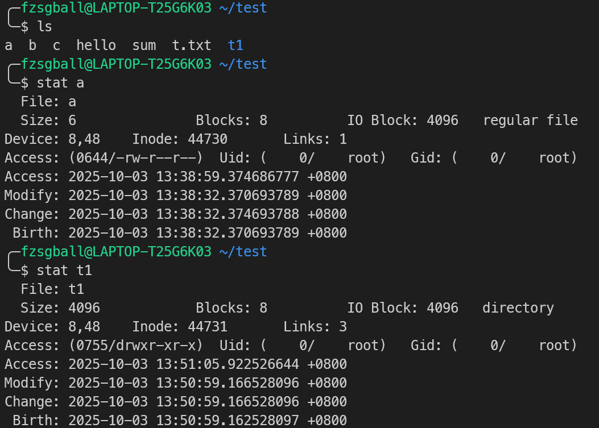

#### 参数（支持参数组合）
`-f`：显示文件所在文件系统的信息

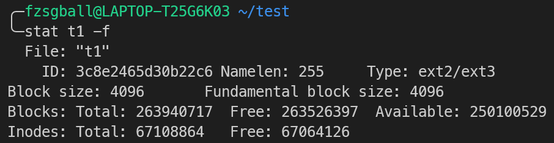

`-t`：以简洁方式输出

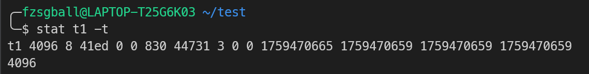

### 9. `more` 命令
该命令用于查看文本文件（且文件内容量大需要翻页的时候）

**使用效果：**

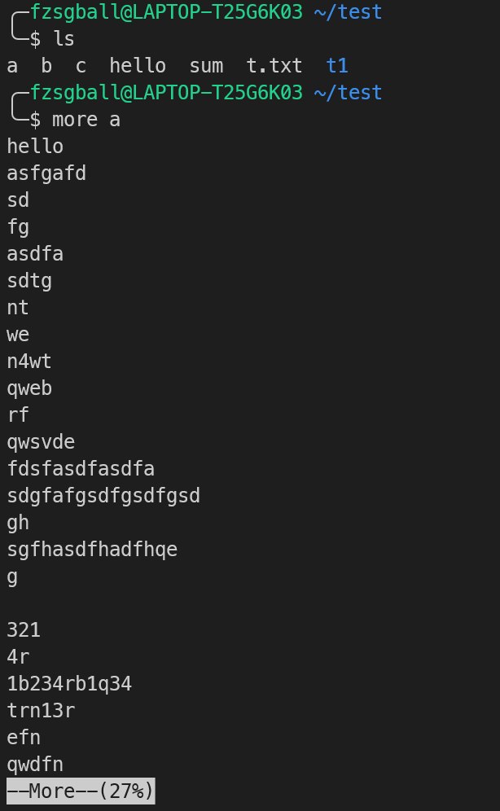

在下方，会有一个百分比表示已显示的内容占全文的比例，因此翻页之后会看到这个百分比会上涨

#### 参数
`+N`：实例用法：
```bash
more +N [file]
```
表示从第N行开始显示

**使用效果：**

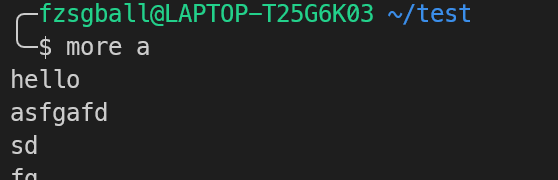
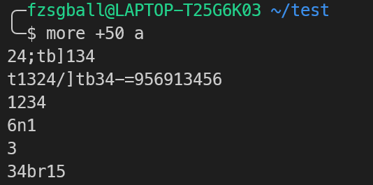

`-N`：实例用法：
```bash
more -N [file]
```
表示一次想查看N行

**使用效果：**


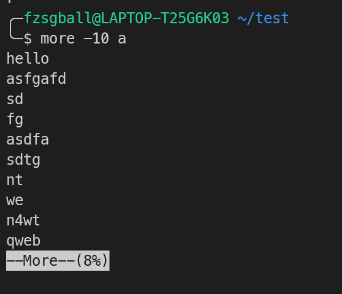

### 10. `less` 命令
与more类似，也是一个可以查看大文本的工具，但是less更倾向于单独开了一个窗口，退出的时候需要按q键进行退出

### 11. `head` 命令
指定显示文件的前N行（默认前10行）

**使用效果：**

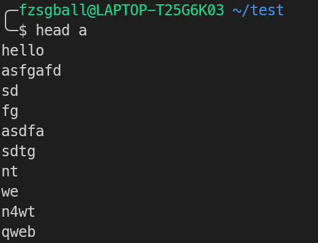

#### 参数
`-N`：指定显示前N行：
```bash
head -N [file]
```
**使用效果：**

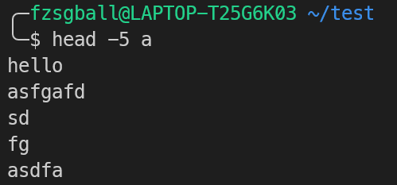

### 12. `tail` 命令
与上一个命令相反，tail命令显示文件的倒数N行

**使用效果：**

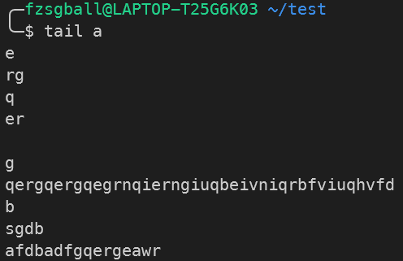

至于参数方面，与head类似，进行类比即可
### 13. `ln` 命令
用于为文件创建链接

插入：软硬链接

在Linux中，inode号才是识别文件数据存储位置的方法，它不等同于文件名称，而是独属于文件的标识符

**硬链接**

指向相同的inode的链接：

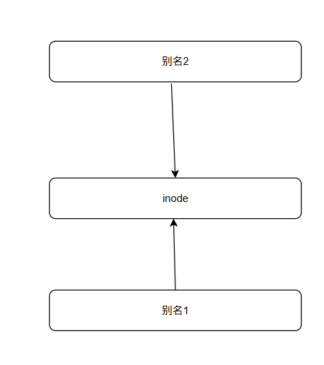

**使用效果：**

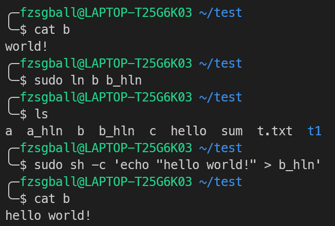

此时，我们若输入 `ls -li` 命令，即可查看这些硬链接和他们的文件之间的关系：

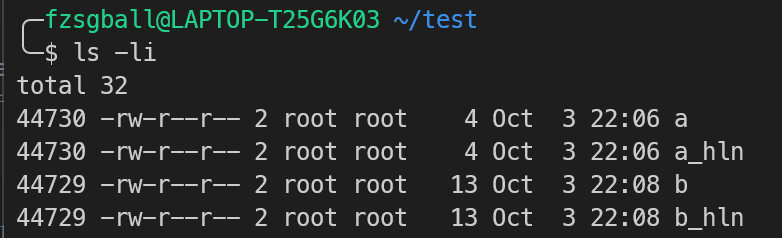

***需要注意的是，a_hln和b_hln均为对应文件a，b的硬链接***

实质上，每创建一个硬链接，实质是多了一个指向这个inode的一个指针，其机制有点类似于C++smart_ptr中的ARC（引用计数）的垃圾回收机制，当这个inode引用次数降为0时，这个文件也就真的被删除了

**软链接**

这是一种特殊类型的文件，它可以将一个新的文件名关联到另一个文件上，并使通过这个新的文件名访问源文件是可行的；但是不共享inode，所以他们两个之间的访问权限，所有者和大小这些属性可能会不同

软链接的一个很大的优势就是它可以跨文件系统或者分区进行创建，非常方便

软连接创建方法：
```bash
ln -s [src] [sym-link]
```
### 14. `rm` 命令
该命令用于删除文件或者目录
> [!WARNING]
> 但是需要注意的是，使用rm命令后文件（目录）无法恢复，需要慎用

#### 参数
`-i`：删除之前逐一确认

**使用效果**

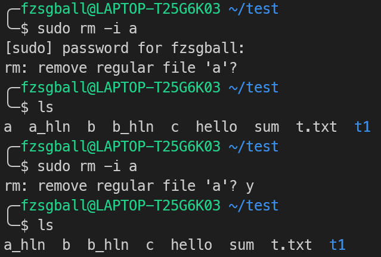

`-r`：递归删除，用于删除目录以及其下所有文件

**使用效果**

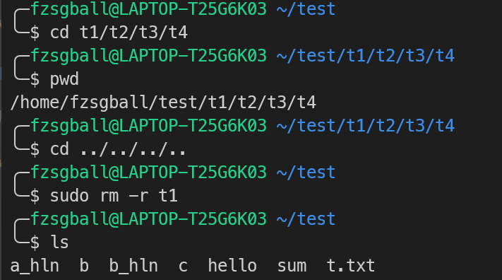

`-f`：不询问，直接删除

> [!NOTE]
> rm命令支持通配符操作，e.g.
> ```bash
> rm -f a*
> ```
> 这表示删除以a开头的所有文件，以此类推

### 15. `cp` 命令
该命令用于复制一个文件或者目录到指定位置
```bash
cp [source] [target]
```

**使用效果**

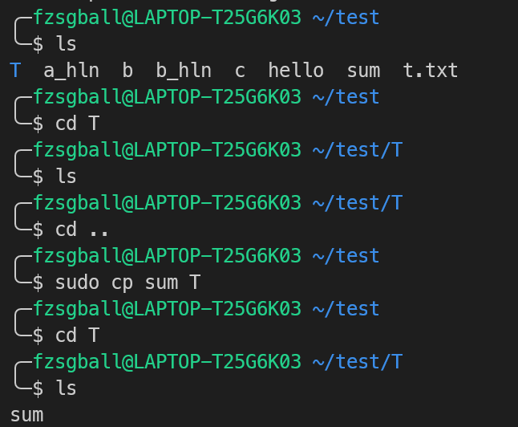

#### 参数
`-r`：递归复制，复制目录及其下所有文件（或目录）
`-p`：保留源文件权限所有者和时间戳
`-f`：强制复制，对重名文件进行覆盖

### 16. `mv` 命令
该命令用于移动文件或者对文件进行改名操作
```bash
mv [source] [target]
```
**使用效果**

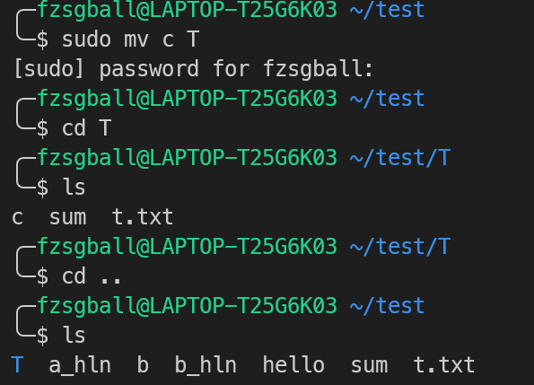

#### 参数
`-b`：对需要覆盖的文件进行备份
`-f`：强制执行，若有重名直接覆盖
`-i`：执行操作前，当有重名时询问

### 17. `chmod` `chown` `chgrp` 命令
上述三个命令主要涉及对文件目录权限的操作，因此放在一起

而在此之前，我们先对linux文件系统的权限系统进行一个了解

在linux中，权限控制针对下面三类主体：
|符号|u|g|o|
|---|---|---|---|
|说明|创建该文件的用户（所有者）|组内的所有用户享受同样的权限（所有组）|不是所有者也不是所属组的其他用户（Other）|

而对于具体的权限类型，则主要分下面三种基本类型：
|符号|r|w|x|
|---|---|---|---|
|说明|可以查看文件内容或者列出目录中的文件列表|可以修改，删除文件内容或者创建删除，重命名目录内的文件|可以运行该文件（前提是可执行程序或者是脚本）或者进入目录（使用cd）|

相应的，这些权限也有他们的表示方法

#### 符号表示法

用符号表示法的时候，一共有10位，他们分别的含义是：
|位置|含义|
|---|---|
|第 1 位|文件类型（如：- 表示普通文件，d 表示目录）|
|第 2-4 位|所有者的权限（rwx）|
|第 5-7 位|所属组的权限（rwx）|
|第 8-10 位|其他用户的权限（rwx）|

e.g.
对于下面的权限表示：
```
drwxr-xr-x
```
第一位表明了这是一个目录 “d”

后面的三位 “rwx” 表示对于权限主体“u”来说，拥有读写执行权限

“r-x” 这一字段这表示所属组拥有读和执行的权限但是没有写的权限

最后的 “r-x” 对于其他用户是同理的

#### 数字表示法

本质是将rwx权限映射为一个三位二进制的串，再将其转化为八进制数字；将每个权限主体内的数字相加之后，便可以得到一个三位数字：e.g. 777

对应的: 
- `r` -> 4
- `w` -> 2
- `x` -> 1
- `-` -> 0

相应的，三位数字上，第几位就代表哪一个权限主体：

- 第一位 -> 所有者（u）
- 第二位 -> 所属组（g）
- 第三位 -> 其他用户（o）

#### **chmod**
该命令用于更改文件或者是目录的权限
```bash
chmod [perms] [target]
```
**使用效果**

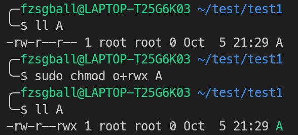

***我们只改变了other的权限，所以仅在后三位发生变动***

##### 用法
对于 **perms** 字段，需要注意的是，在指定之前需要指定权限主体，如：

```
u+rwx
```
意味着对文件拥有者添加rwx权限

这里的符号可以在+/-二者中选择，+代表添加对应的权限，-代表删除对应的权限

同时，可以以逗号隔开以便对多个权限主体进行权限制定

**使用效果**

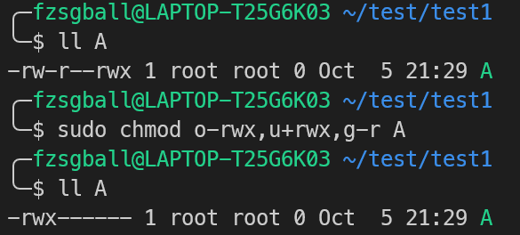

#### **chgrp**
该命令用于更改文件或者是目录的所属组
```bash
chgrp [grp-name] [file]
```

**使用效果**

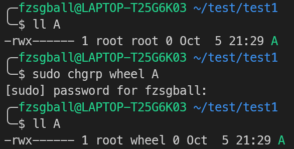

##### 参数
`-R`：递归执行，对当前目录下的所有文件或者目录进行chgrp操作

### 18. `umask` 命令
该指令用于指定文件或者目录创建时的默认权限

**使用效果（以八进制形式指定）**

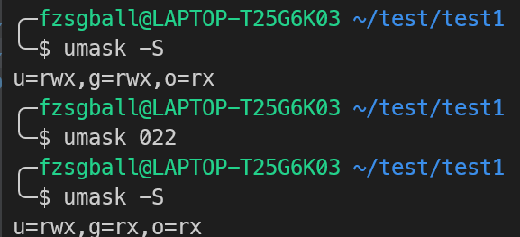

需要注意的是，用这种方式指定的时候，所给出的值是被对位的最大值相减得到的，用下表解释：

||读(4)|写(2)|执行(1)|八进制|符号表示|
|---|---|---|---|---|---|
|最大默认 (666)|rw-|rw-|rw-|666|rw-rw-rw-|
|`-` umask (022)|-0|-2|-2|-022|----w--w-|
|`=` 最终权限|rw-|r–|r–|644|rw-r--r--|

当然，也可以以符号方式指定，类似于chmod指令的指定方式，采用：
```
[type] +/- [permission]
```
的方式进行指定

**使用效果（以符号形式指定）**

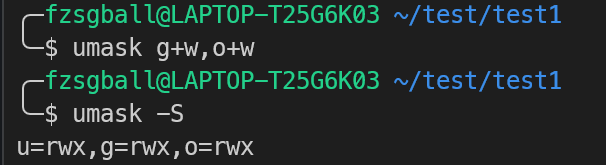

### 19. `man` 命令
查看系统自带的手册，虽然是英文版
```
man [cmd]
```
表示查看对应指令的手册

**使用效果**

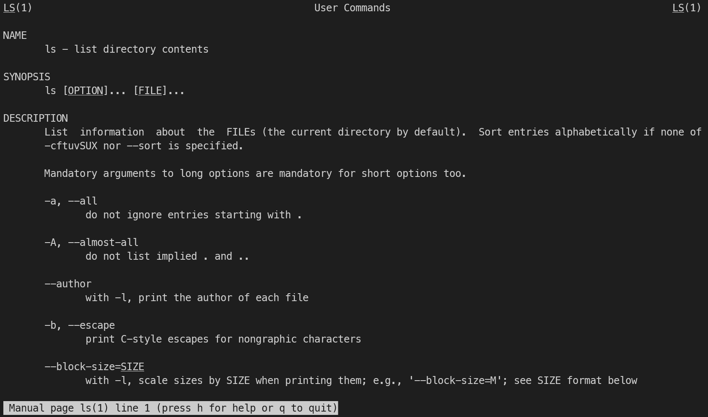

### 20. `info` 指令
与man命令类似，但是功能更高级

**使用效果**

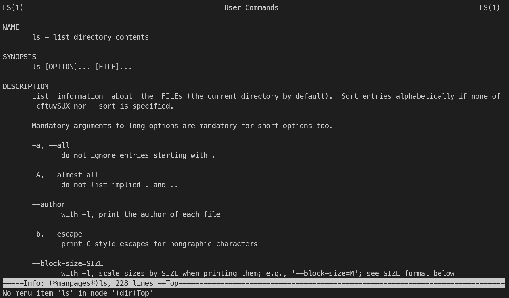