# Linux命令基本操作

使用Linux时，不可避免地会使用到Linux的终端，因此我们需要对其中的命令进行熟悉，尤其是那些常用的命令
因此，本篇对常用的命令进行了收集和说明

### 1. `cat`  命令
cat命令作用是查看文件内容，格式为：
```
cat [file-name]
```
**使用效果：**


其它用法： 
#### 1.
```
cat [file-1] [file-2] ... > [file-n]
```
将file-1，-2，.....的内容连接起来，再写入文件file-n中
```
举个例子，假如有文件file-1，file-2，file-3
其中file-1内容为一个数字1，file-2内容为数字2，file-3内容为数字3

[input]           : cat file-1 file-2 > file-3
[file-3 content]  : 12
```
**使用效果：**


#### 2.
```
cat [file-1] [file-2] ... >> [file-n]
```
将file-1，-2，.....的内容连接起来，再 ****以追加的方式**** 写入文件file-n中
```
举个例子:

[input]           : cat file-1 file-2 >> file-3
[file-3 content]  : 312
```

> [!WARNING]
> 在使用上述命令时，应该以如下方式使用 (以第一个为例):
> ```
> sudo sh -c 'cat [file-1] [file-2] ... > [file-n]'
> ```
> 这个问题的原因是因为重定向 `> [file-n]` 的操作并不是由sudo执行而是shell，使用的是普通用户的权限
> 因此使用了sudo的指令只有前半段 `cat [file-1] [file-2] ...`，于是导致了问题的出现

### 2. `touch` 命令
touch命令作用是创建文件，格式为:
```
touch [file-1] [file-2] ...
```
运行后，系统会创建以touch命令之后的字段为名的文件

**使用效果：**


### 3. `file` 命令
file命令用于确定对应文件的文件类型，在没有文件拓展名的情况下依然适用: 
```
file [file-name]
```

**使用效果：**


### 4. `cd` 命令
cd命令用于更改当前工作目录

**使用效果：**


### 5. `pwd` 命令
该命令用于输出当前的工作目录

**使用效果：**


### 6. `mkdir` 命令
该命令用于在当前工作目录下创建一个目录

**使用效果：**


#### 参数（参数支持组合）：

`-p`：该用法可以创建多级目录，即使父目录不在的情况下也能创建

**使用效果：**


`-v`：该用法可以在创建目录的时候输出对应信息

**使用效果：**


### 7. `rmdir` 命令
rmdir只能用于用于删除空的目录

**使用效果：**


而当你尝试用rmdir删除一个非空目录的时候，会报错：


***其中，t1是我们先前用于演示 mkdir -p 时的产物（t1里面还有其他目录）***

### 8. `stat` 命令
该命令用于显示文件或者文件系统的详细信息

**使用效果：**


#### 参数（支持参数组合）
`-f`：显示文件所在文件系统的信息


`-t`：以简洁方式输出


### 9. `more` 命令
该命令用于查看文本文件（且文件内容量大需要翻页的时候）

**使用效果：**


在下方，会有一个百分比表示已显示的内容占全文的比例，因此翻页之后会看到这个百分比会上涨

#### 参数
`+N`：实例用法：
```bash
more +N [file]
```
表示从第N行开始显示

**使用效果：**


`-N`：实例用法：
```bash
more -N [file]
```
表示一次想查看N行

**使用效果：**


### 10. `less` 命令
与more类似，也是一个可以查看大文本的工具，但是less更倾向于单独开了一个窗口，退出的时候需要按q键进行退出

### 11. `head` 命令
指定显示文件的前N行（默认前10行）

**使用效果：**


#### 参数
`-N`：指定显示前N行：
```bash
head -N [file]
```
**使用效果：**


### 12. `tail` 命令
与上一个命令相反，tail命令显示文件的倒数N行

**使用效果：**


至于参数方面，与head类似，进行类比即可
### 13. `ln` 命令
用于为文件创建链接

插入：软硬链接

在Linux中，inode号才是识别文件数据存储位置的方法，它不等同于文件名称，而是独属于文件的标识符

**硬链接**

指向相同的inode的链接：


**使用效果：**


此时，我们若输入 `ls -li` 命令，即可查看这些硬链接和他们的文件之间的关系：


***需要注意的是，a_hln和b_hln均为对应文件a，b的硬链接***

实质上，每创建一个硬链接，实质是多了一个指向这个inode的一个指针，其机制有点类似于C++smart_ptr中的ARC（引用计数）的垃圾回收机制，当这个inode引用次数降为0时，这个文件也就真的被删除了

**软链接**

这是一种特殊类型的文件，它可以将一个新的文件名关联到另一个文件上，并使通过这个新的文件名访问源文件是可行的；但是不共享inode，所以他们两个之间的访问权限，所有者和大小这些属性可能会不同

软链接的一个很大的优势就是它可以跨文件系统或者分区进行创建，非常方便

软连接创建方法：
```bash
ln -s [src] [sym-link]
```
### 14. `rm` 命令
该命令用于删除文件或者目录
> [!WARNING]
> 但是需要注意的是，使用rm命令后文件（目录）无法恢复，需要慎用

#### 参数
`-i`：删除之前逐一确认

**使用效果**


`-r`：递归删除，用于删除目录以及其下所有文件

**使用效果**


`-f`：不询问，直接删除

> [!NOTE]
> rm命令支持通配符操作，e.g.
> ```bash
> rm -f a*
> ```
> 这表示删除以a开头的所有文件，以此类推

### 15. `cp` 命令
该命令用于复制一个文件或者目录到指定位置
```bash
cp [source] [target]
```

**使用效果**


#### 参数
`-r`：递归复制，复制目录及其下所有文件（或目录）
`-p`：保留源文件权限所有者和时间戳
`-f`：强制复制，对重名文件进行覆盖

### 16. `mv` 命令
该命令用于移动文件或者对文件进行改名操作
```bash
mv [source] [target]
```
**使用效果**


#### 参数
`-b`：对需要覆盖的文件进行备份
`-f`：强制执行，若有重名直接覆盖
`-i`：执行操作前，当有重名时询问

### 17. `chmod` `chown` `chgrp` 命令
上述三个命令主要涉及对文件目录权限的操作，因此放在一起

而在此之前，我们先对linux文件系统的权限系统进行一个了解

在linux中，权限控制针对下面三类主体：
|符号|u|g|o|
|---|---|---|---|
|说明|创建该文件的用户（所有者）|组内的所有用户享受同样的权限（所有组）|不是所有者也不是所属组的其他用户（Other）|

而对于具体的权限类型，则主要分下面三种基本类型：
|符号|r|w|x|
|---|---|---|---|
|说明|可以查看文件内容或者列出目录中的文件列表|可以修改，删除文件内容或者创建删除，重命名目录内的文件|可以运行该文件（前提是可执行程序或者是脚本）或者进入目录（使用cd）|

相应的，这些权限也有他们的表示方法

#### 符号表示法

用符号表示法的时候，一共有10位，他们分别的含义是：
|位置|含义|
|---|---|
|第 1 位|文件类型（如：- 表示普通文件，d 表示目录）|
|第 2-4 位|所有者的权限（rwx）|
|第 5-7 位|所属组的权限（rwx）|
|第 8-10 位|其他用户的权限（rwx）|

e.g.
对于下面的权限表示：
```
drwxr-xr-x
```
第一位表明了这是一个目录 “d”

后面的三位 “rwx” 表示对于权限主体“u”来说，拥有读写执行权限

“r-x” 这一字段这表示所属组拥有读和执行的权限但是没有写的权限

最后的 “r-x” 对于其他用户是同理的

#### 数字表示法

本质是将rwx权限映射为一个三位二进制的串，再将其转化为八进制数字；将每个权限主体内的数字相加之后，便可以得到一个三位数字：e.g. 777

对应的: 
- `r` -> 4
- `w` -> 2
- `x` -> 1
- `-` -> 0

相应的，三位数字上，第几位就代表哪一个权限主体：

- 第一位 -> 所有者（u）
- 第二位 -> 所属组（g）
- 第三位 -> 其他用户（o）

#### **chmod**
该命令用于更改文件或者是目录的权限
```bash
chmod [perms] [target]
```
**使用效果**


***我们只改变了other的权限，所以仅在后三位发生变动***

##### 用法
对于 **perms** 字段，需要注意的是，在指定之前需要指定权限主体，如：

```
u+rwx
```
意味着对文件拥有者添加rwx权限

这里的符号可以在+/-二者中选择，+代表添加对应的权限，-代表删除对应的权限

同时，可以以逗号隔开以便对多个权限主体进行权限制定

**使用效果**


#### **chgrp**
该命令用于更改文件或者是目录的所属组
```bash
chgrp [grp-name] [file]
```

**使用效果**


##### 参数
`-R`：递归执行，对当前目录下的所有文件或者目录进行chgrp操作

### 18. `umask` 命令
该指令用于指定文件或者目录创建时的默认权限

**使用效果（以八进制形式指定）**


需要注意的是，用这种方式指定的时候，所给出的值是被对位的最大值相减得到的，用下表解释：

||读(4)|写(2)|执行(1)|八进制|符号表示|
|---|---|---|---|---|---|
|最大默认 (666)|rw-|rw-|rw-|666|rw-rw-rw-|
|`-` umask (022)|-0|-2|-2|-022|----w--w-|
|`=` 最终权限|rw-|r–|r–|644|rw-r--r--|

当然，也可以以符号方式指定，类似于chmod指令的指定方式，采用：
```
[type] +/- [permission]
```
的方式进行指定

**使用效果（以符号形式指定）**


### 19. `man` 命令
查看系统自带的手册，虽然是英文版
```
man [cmd]
```
表示查看对应指令的手册

**使用效果**


### 20. `info` 命令
与man命令类似，但是功能更高级

**使用效果**


### 21. `help` 命令
用于简略的查看各个命令的帮助

> [!WARNING]
> 该命令是bash的内建命令，因此当运行其它shell的时候会提示“help not found”

**使用效果**

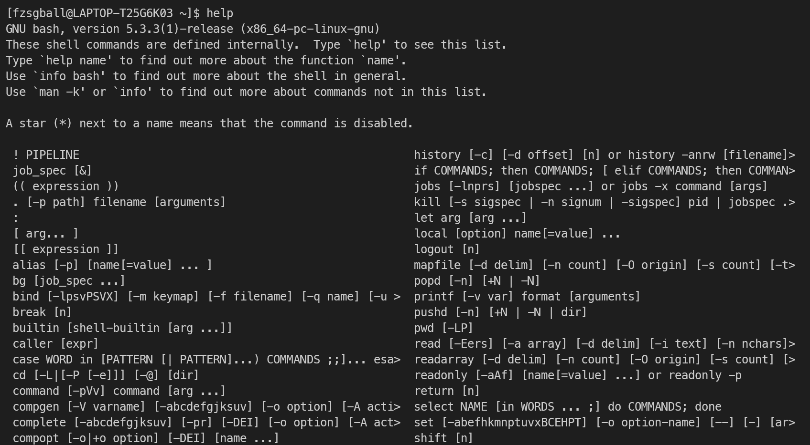

### 22. `which` 命令
用于定位系统中的可执行文件，返回第一个找到的结果

**使用效果**

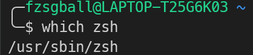

#### 参数
`-a`：列出全部符合要求的项目

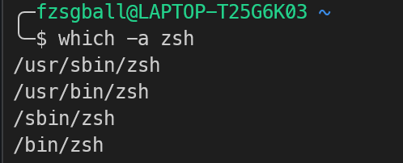

### 23. `whereis` 命令
whereis命令提供了比which更多的信息，除了可执行文件以外，它还能定位其他的相关文件，如手册文件或者源代码文件

**使用效果**

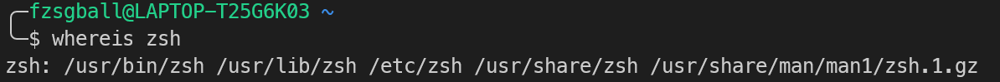

### 24. `find` 命令
用于查找指定的文件
```bash
find [source] -[mode] [expect]
```

#### 常见mode：
`-name`：按照文件名查找
`-iname`：不分大小写查找文件

**使用效果**

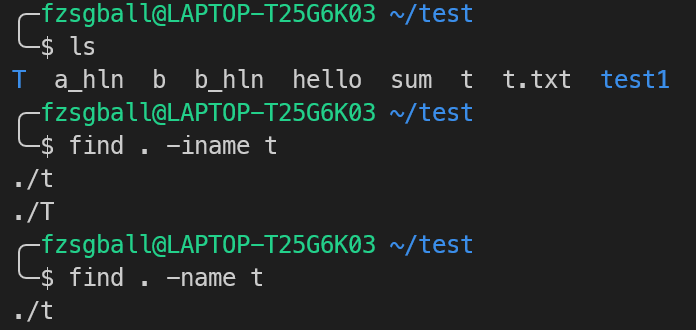

### 24. `locate` 命令
用于列出路径中匹配给定pattern的实例
```bash
locate [options] [pattern]
```

**使用效果**

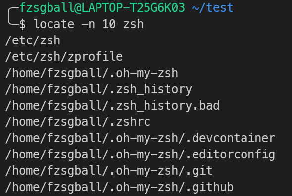

#### 常见参数
`-n N`：指定输出找到的前N行

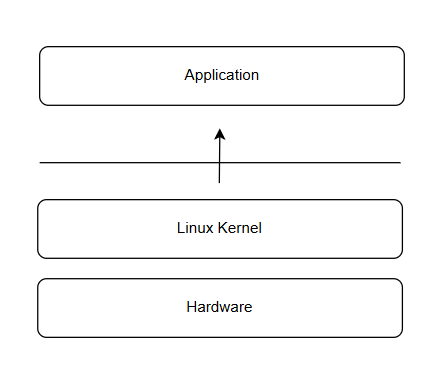

`-i`：忽略大小写进行查找

`-b`：仅匹配基本名称（仅关注路径的最后部分）

### 25. `grep` 命令
grep是linux中的一个文本搜索工具，用于在文件中查找符合条件的字符串或者正则表达式
```bash
grep [options] pattern [files]
```
**使用效果**

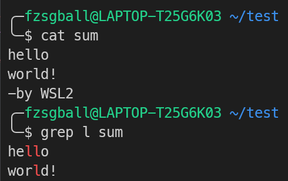

#### 参数
`-i`：忽略大小写进行匹配

`-v`：查找不匹配的行

`-n`：显示匹配的行的行号

`-l`：只打印匹配的文件的文件名

### 26. `shutdown` 命令
用于关机

#### 参数
`now`：指定现在就关机

### 27. `reboot` 命令
用于重启系统

### 28. `init` 命令
设置系统的Runlevel参数，是一种系统级命令

### 29. `systemctl` 命令
用于管理systemd系统和服务管理器的工具
```bash
systemctl [options] command [name]
```
#### 参数
`start`：启动指定的服务

`stop`：停止指定的服务

`restart`：重启指定的服务

`status`：查看指定服务的状态

**使用效果**

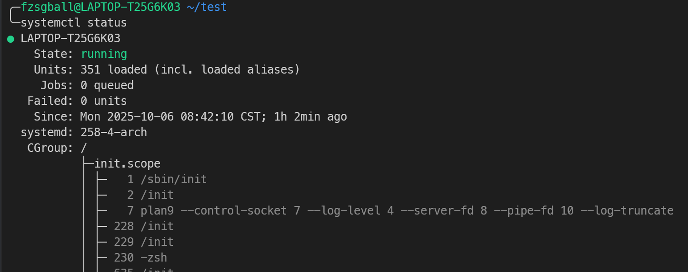

`enable`：设置服务开机自启

### 30. `ifconfig` 命令
该命令允许用户查看和设置网络设备的状态，例如分配IP地址、启用或禁用网络接口、管理ARP缓存和路由等
```bash
ifconfig [eth] [options]
```

**使用效果**

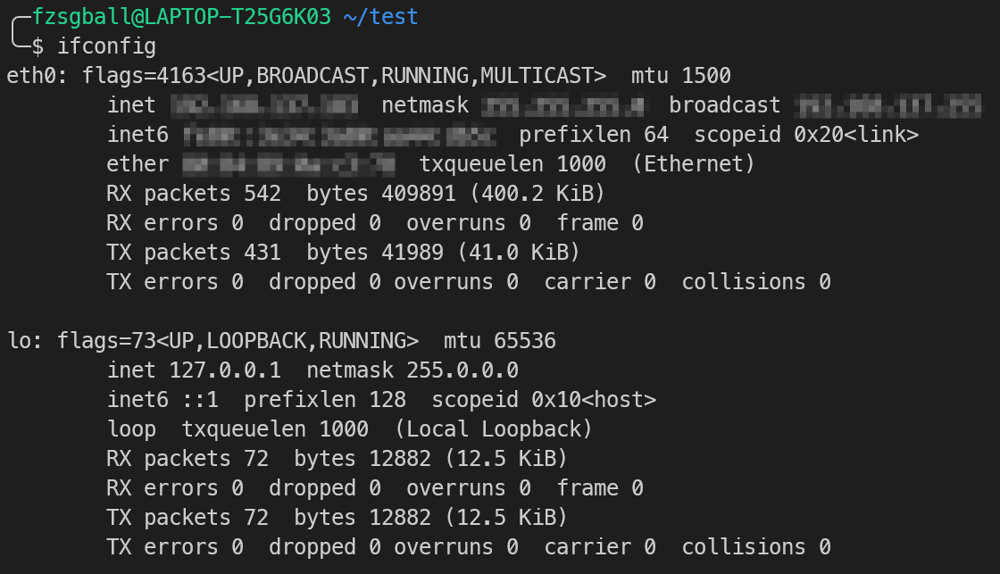

#### 参数
`up/down`：up用于启用网卡，down用于关闭网卡

`mtu`：设置最大传输单元（单位：byte）

`add/del`：新增（删除）IP地址，临时生效

### 31. `ping` 命令
该命令用于检测与另一台主机之间的网络连接

**使用效果**

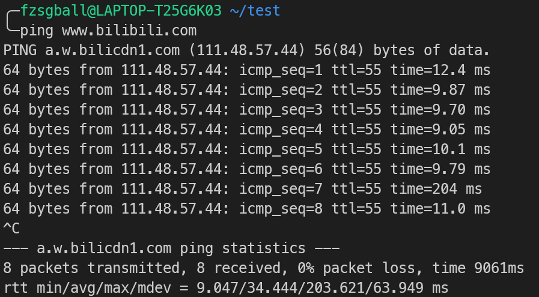

#### 参数
`-c N`：设置发送请求的次数为N

`-i N`：设置每隔N秒发送一个请求

`-s S`：设置发送的数据包大小（单位：byte）

### 32. `netstat` 命令
该命令用于显示网络连接、路由表、接口统计数据、伪装连接、多播成员等网络相关信息

**使用效果**

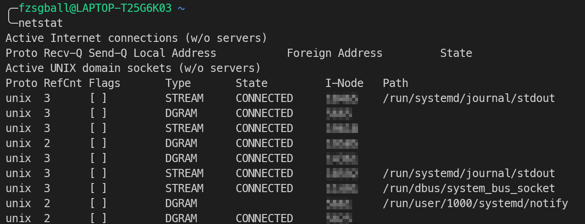

### 32. `w` 命令
该命令用于显示当前登录到系统中的用户及其进程的信息。它可以显示谁已登录，以及他们正在执行的活动和进程

**使用效果**

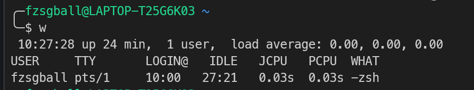

### 33. `last` 命令
该命令追踪用户的登录情况，包括登录时间、持续时间、登录终端以及登录IP地址等信息

**使用效果**

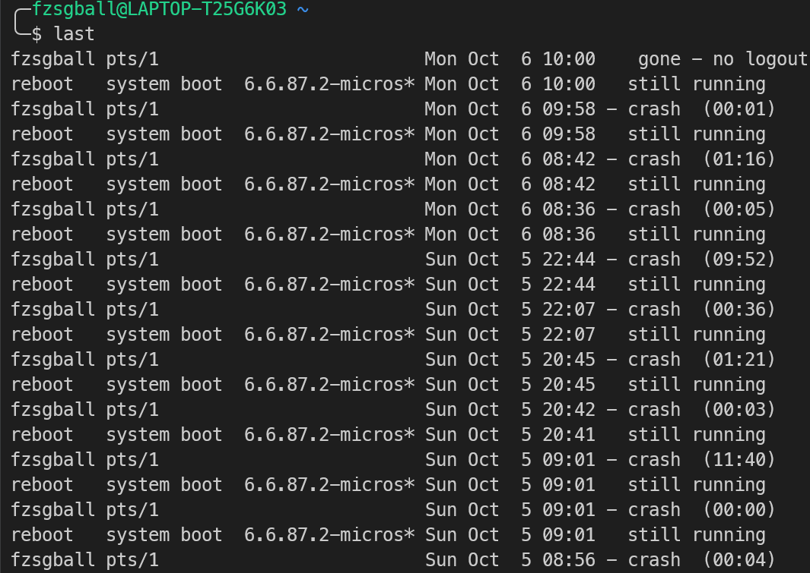

### 34. `lastlog` 命令
该命令可以查看到每个系统用户最近一次登陆系统的时间

**使用效果**

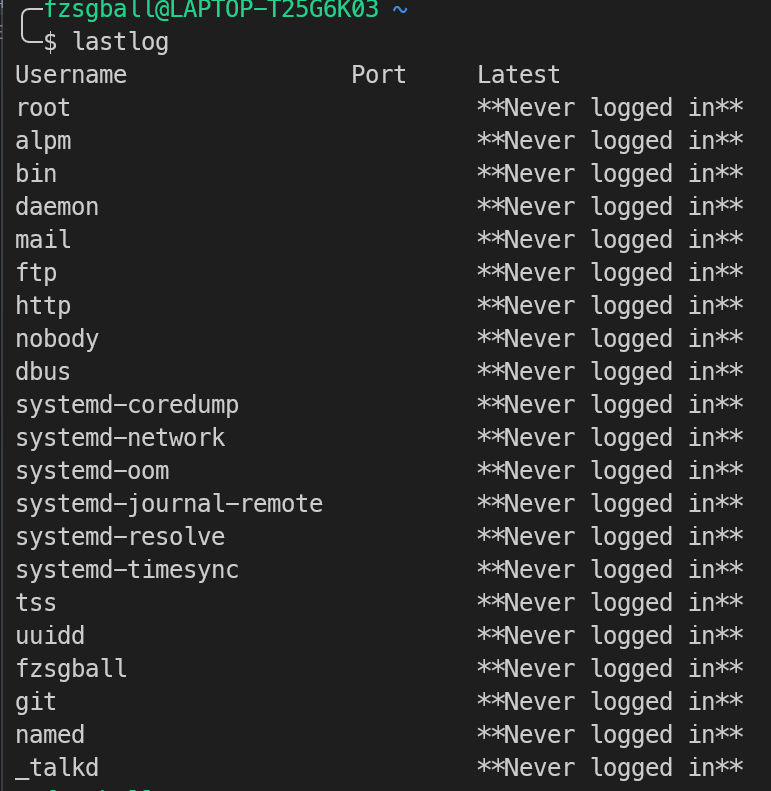

### 35. `echo` 命令
用于输出显示文本或者是变量的值

**使用效果**

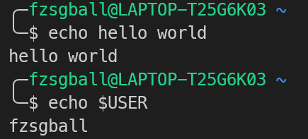
#### 其他用法
- 重定向操作
  ```bash
  echo [text] > [target]
  ```
  这个用法会使echo的内容输入到文件target中去

  **使用效果**

  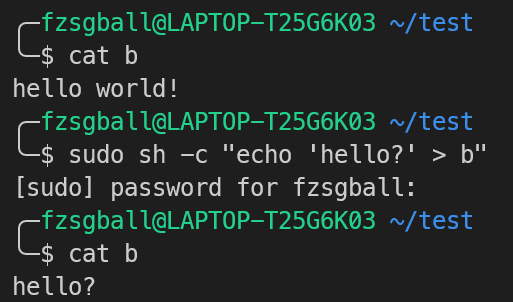

### 36 - 43：关于用户系统的命令操作
先对Linux的用户系统进行简单的介绍

1. 用户 (Users)
在 Linux 中，每个与系统交互的实体（无论是人还是系统服务）都被视为一个用户。

唯一标识： 每个用户都有一个用户名 (Username) 和一个唯一的用户 ID (UID)。

UID 0： 始终保留给 root (超级用户)。

root 用户（超级用户）：

也被称为管理员。

拥有最高权限，可以执行系统上的任何操作，包括修改系统配置、安装软件和访问任何文件。

出于安全考虑，日常操作不建议直接使用 **root** 账户，而是使用 **sudo** 命令临时获取权限。

普通用户：

通过日常登录使用的账户。

权限受限，通常只能在自己的家目录 (/home/username) 中自由操作。

系统用户：

为特定的系统服务（如 daemon、sshd、mysql 等）创建的账户。

它们的 UID 通常低于 1000，没有登录 Shell，主要用于隔离和限制服务的权限，以增强系统安全性。

2. 用户组 (Groups)
用户组是用户的集合。它简化了权限管理：与其为每个用户单独设置权限，不如将权限授予一个组，然后将需要的用户加入该组。

唯一标识： 每个组都有一个组名和一个唯一的组 ID (GID)。

主组 (Primary Group)：

用户登录时自动归属的默认组。

用户创建的新文件或目录通常会自动将该组设置为其主组。

附加组 (Secondary Groups)：

用户可以同时属于多个附加组，从而获得这些组所赋予的额外资源访问权限。

例如，用户可能需要加入 **wheel** 或 **sudo** 组才能使用 **sudo** 命令。

其中：涉及到/etc/passwd和/etc/shadow两个文件

这两个文件是 Linux/Unix 系统中用户账户管理的核心。它们协同工作，/etc/passwd 负责存储用户的一般信息，而 /etc/shadow 则负责存储敏感的安全信息，特别是加密后的密码

其中，对于 `$` 和 `#` 符号，给出下面的解释

`$`：是普通的用户，权限受到限制
`#`：是超级用户“root”

下面对与用户和组管理密切相关的一组常用命令进行说明：`useradd`、`passwd`、`usermod`、`userdel`、`su`、`groupadd`、`groupdel`、`gpasswd`

#### useradd（创建用户）
用途：创建新用户账号并初始化账户相关文件
```
useradd [options] username
```
常用选项：
- `-m`：创建用户主目录（例如 /home/username）
- `-d home_dir`：指定主目录路径
- `-s shell`：指定登录 shell（例如 /bin/bash）
- `-G group1,group2`：指定附加组
- `-u UID`：指定用户的 UID

#### passwd（设置/修改密码）
用途：设置或更改用户密码，或锁定/解锁账户密码
```
passwd [options] [username]
```
常用用法：
- 交互式：直接运行 `passwd` 或 `passwd username`，按提示输入新密码
- `-l username`：锁定用户密码（在 `/etc/shadow` 中加 `!`）
- `-u username`：解锁用户密码

注意：修改密码后建议遵循强密码策略，必要时配合 PAM 策略限制

#### usermod（修改用户）
用途：修改已有用户的属性（如用户名、主目录、附加组、登录 shell 等）
```
usermod [options] username
```
常用选项：
- `-l new_login`：更改登录名。
- `-d home_dir`：更改主目录（配合 `-m` 移动原有内容）
- `-m`：移动主目录内容。
- `-G group1,group2`：设置附加组（覆盖）。
- `-aG group`：追加附加组（与 `-G` 一起使用时保留原组）
- `-s shell`：设置登录 shell。

注意：对正在登录的用户修改某些属性可能无效或带来风险，操作前请备份并确认无活跃进程

#### userdel（删除用户）
用途：删除系统用户账号。
```
userdel [options] username
```
常用选项：
- `-r`：同时删除用户主目录和邮件目录

注意：删除前请确认用户无重要数据或运行中进程，可先锁定账号（`usermod -L username`）并备份主目录

#### su（切换用户）
用途：切换为另一个用户（默认切换到 root）
```
su [options] [username]
```
常见用法：
- `su`：切换到 root（需 root 密码）
- `su -` 或 `su -l`：切换并加载目标用户登录环境
- `su username`：切换到指定用户

注意：现代发行版通常推荐使用 `sudo`（如 `sudo -i` 或 `sudo -s`）代替直接使用 `su`。

#### groupadd（创建组）
用途：创建新组。
```
groupadd [options] groupname
```
常用选项：
- `-g GID`：为新组指定 GID（组 ID）

#### groupdel（删除组）
用途：删除已有组。
```
groupdel groupname
```

注意：删除组不会自动删除其用户，需要先调整这些用户的主组或附加组

#### gpasswd（管理组）
用途：管理组密码、组管理员和成员关系
```
gpasswd [options] group
```
常用选项：
- `-a user`：添加成员。
- `-d user`：删除成员。
- `-A user1,user2`：设置组管理员。
- `-R`：移除组密码相关信息（修改 /etc/gshadow）

注意：现代系统一般不用组口令，更常通过组和 sudo 等机制管理权限

### 引用
- [Linux系统之ifconfig命令的基本使用](https://zhuanlan.zhihu.com/p/12614202912)
- [Linux last和lastlog命令：查看过去登陆的用户信息](https://c.biancheng.net/view/3875.html)
- [Linux基础命令systemctl详解](https://zhuanlan.zhihu.com/p/6985891769)
- [Linux find命令：在目录中查找文件（超详解）](https://c.biancheng.net/view/779.html)
- [Linux之locate命令](https://zhuanlan.zhihu.com/p/386616614)
- [Linux—umask（创建文件时的掩码）用法详解](https://blog.csdn.net/Change_Improve/article/details/106107317)
- [Linux权限详解（chmod、600、644、700、711、755、777、4755、6755、7755）「建议收藏」](https://cloud.tencent.com/developer/article/2069886)
- [linux中mv命令使用详解](https://blog.csdn.net/qq_43248623/article/details/107819260)