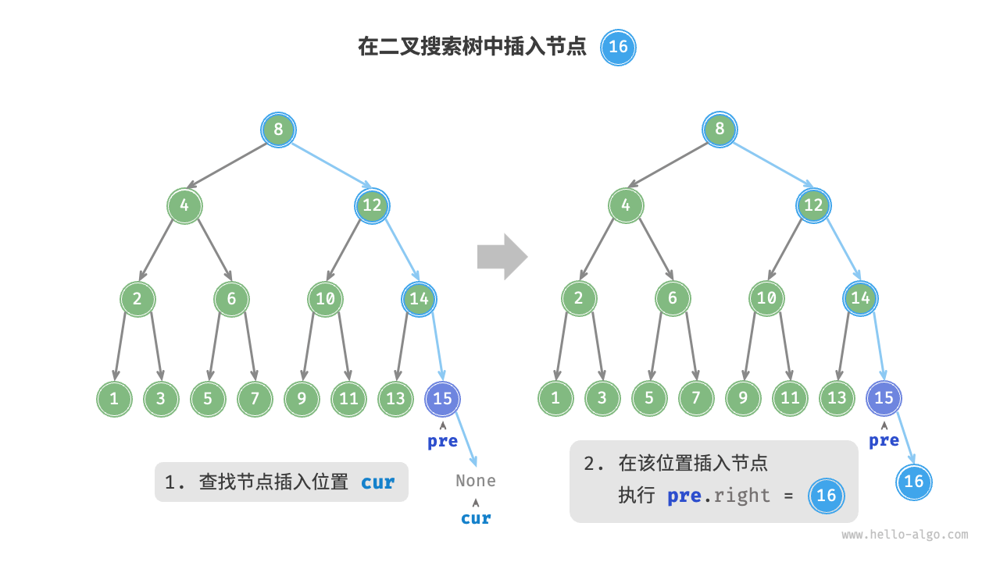
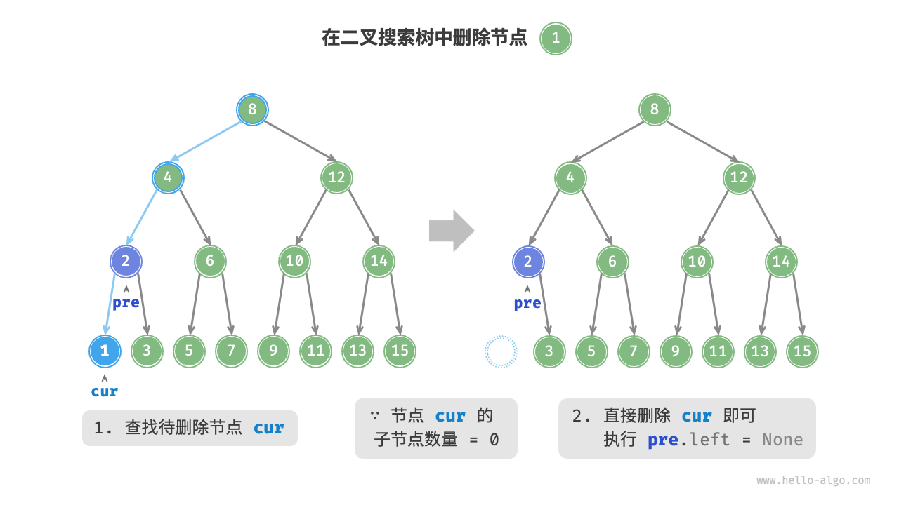
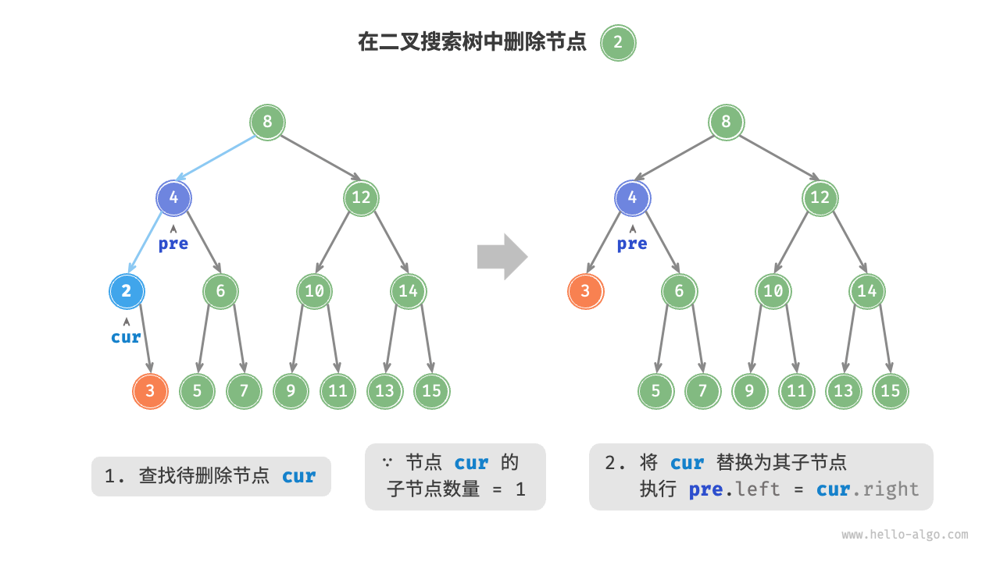
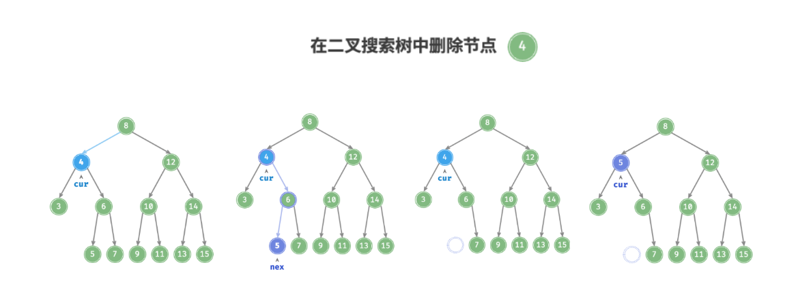

# 二叉搜索树
一种特殊的二叉树，这里单独进行讨论

一个二叉搜索树，有如下性质：
- 对于树内的任何节点，左子节点 < 父节点 < 右子节点
- 树内元素不重复
  
为了方便讨论，我们定义如下结构，并定义测试数据：
```c++
struct TreeNode {
    int val = 0;
    TreeNode* left = nullptr;
    TreeNode* right = nullptr;

    TreeNode()=default;
    TreeNode(int v): val(v) {}

    void print() {
        if (left == nullptr && right == nullptr)
            std::cout <<"("<< val <<")";
        else
            std::cout << val << ":{" ;

        if (left)
            left->print();
        if (right)
            right->print();

        if (!(left == nullptr && right == nullptr)) {
            std::cout << "}";
        }
    }
};

class BSTree {
    TreeNode* root;

public:
    BSTree()=default;
};
```
下面，我们将对 `BSTree` 类进行扩写，同时，这蕴含着二叉搜索树里面的一些知识

## 插入操作
得益于二叉树自身的特殊性质，插入时，我们只需按照下面的原则进行就行：

**对要插入的元素与当前节点进行检查，如果要插入元素大于当前节点元素，则在右边进行插入，否则在左边进行**



代码：
```c++
void insert(int element, TreeNode* current = nullptr) {
    if (!current) {
        // Is root
        if (element >= root->val) {
            if (root->right != nullptr) {
                insert(element, root->right);
            }
            else {
                root->right = new TreeNode(element);
            }
        }
        else {
            if (root->left != nullptr) {
                insert(element, root->left);
            }
            else {
                root->left = new TreeNode(element);
            }
        }
    }
    else {
        if (element >= current->val) {
            if (current->right != nullptr) {
                insert(element, current->right);
            }
            else {
                current->right = new TreeNode(element);
            }
        }
        else {
            if (current->left != nullptr) {
                insert(element, current->left);
            }
            else {
                current->left = new TreeNode(element);
            }
        }
    }
}
```

## 删除操作
比较麻烦的是删除操作，需要对目标的**度（D）**进行讨论，统共分三种情况：
- $D = 1$
- $D = 2$
- $D = 0$

### $D = 0$ 的情况
$D = 0$ 的情况是最好解决的，因为这个时候直接把这个节点删除即可，删除之后，不会对原有树造成影响



### $D = 1$ 的情况
当 $D = 1$ 时，需要将该节点下的子节点接上当前节点的父节点，从而达到当前节点被删除的目的



### $D = 2$ 的情况
当 $D = 2$ 时，情况复杂许多，不能像 $D = 0$ 那样直接删除；也不能像 $D = 1$ 进行简单的变换

因此，必须对当前的节点进行一定的替换的操作；换言之，用某一个符合BST性质的节点来替换当前节点

事实上，这个节点可以是***右子树的最小节点***或***左子树的最大节点***，如下举例：



综上所述，我们可以把删除某个节点的代码如下写：
```c++
void del(int target) {
    if (root == nullptr)
        return;
    TreeNode *cur = root, *pre = nullptr;
    while (cur != nullptr) {
        if (cur->val == target)
            break;
        pre = cur;
        if (cur->val < target)
            cur = cur->right;
        else
            cur = cur->left;
    }
    if (cur == nullptr)
        return;
    if (cur->left == nullptr || cur->right == nullptr) {
        TreeNode *child = cur->left != nullptr ? cur->left : cur->right;
        if (cur != root) {
            if (pre->left == cur)
                pre->left = child;
            else
                pre->right = child;
        } else {
            root = child;
        }
        delete cur;
    }
    else {
        TreeNode *tmp = cur->right;
        while (tmp->left != nullptr) {
            tmp = tmp->left;
        }
        int tmpVal = tmp->val;
        del(tmp->val);
        cur->val = tmpVal;
    }
}
```

## 查找操作
查找二叉搜索树内的某个元素时，得益于BST自身的性质，我们可以很简单的进行操作：

对比目标元素与当前节点的元素，如果目标元素大于当前节点元素，在右侧进行比较，否则在左侧进行比较：

```c++
bool has(int target) {
    TreeNode *cur = root;
    while (cur != nullptr) {
        if (cur->val < target)
            cur = cur->right;
        else if (cur->val > target)
            cur = cur->left;
        else
            break;
    }
    return cur;
}
```

## 效率对比
使用二叉搜索树和数组查找的方式如下表进行对比：

| 对比项 | 数组查找 | BST        |
| ------ | -------- | ---------- |
| 查找   | $O(n)$   | $O(log n)$ |
| 插入   | $O(1)$   | $O(log n)$ |
| 删除   | $O(n)$   | $O(log n)$ |

由上表不难看出，BST相比于数组方式更加稳定；但即便如此，数组在高频添加、低频查找删除数据的情景下效率比BST要高

# 参考
[Hello algo - 7.4 二叉搜索树](https://www.hello-algo.com/chapter_tree/binary_search_tree/#742)