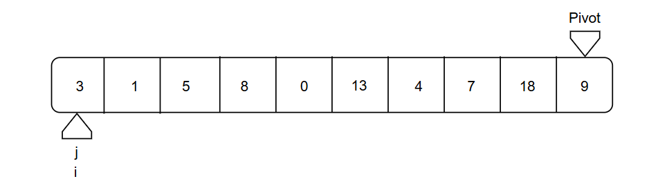
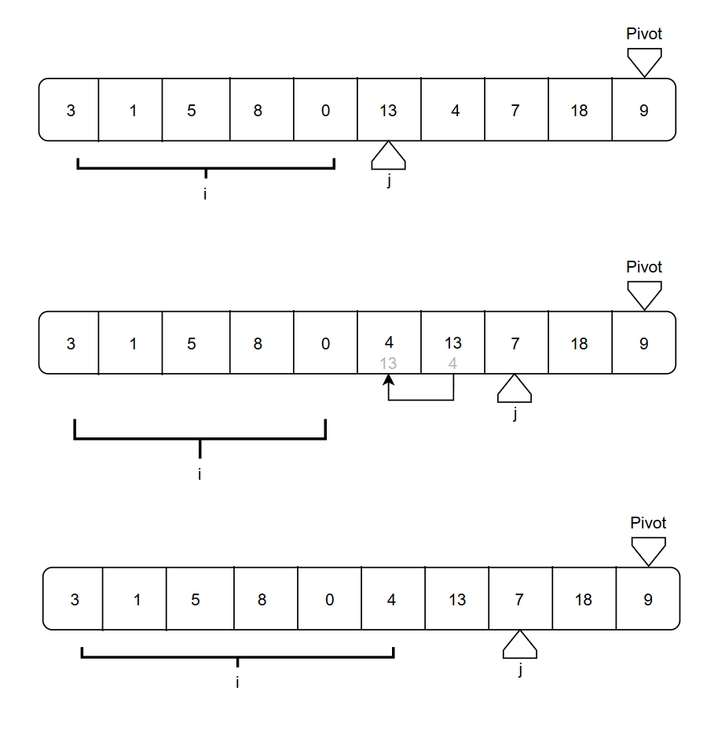
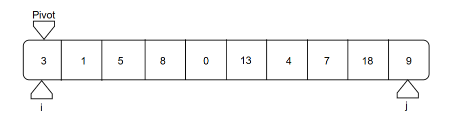
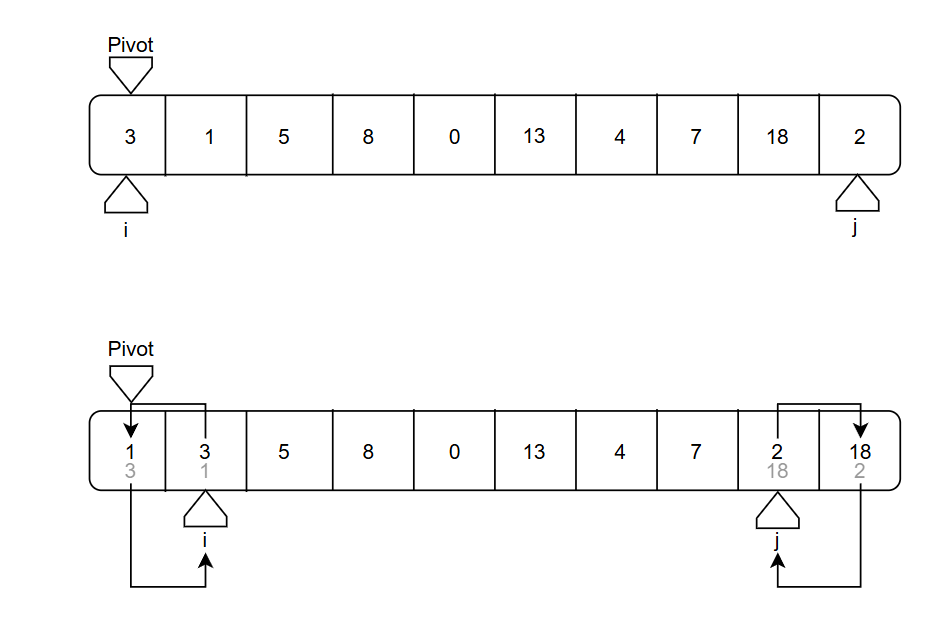

# 快速排序

## 核心思路：
**主要用分治的方法对给定的数组进行排序，直到排序完成**

## 具体步骤：
1. 选定基准，将数组划分为两个部分（基准之前比基准小，基准之后比基准大）
2. 对划分的部分进行递归的快速排序
3. 重复步骤 **1 - 2**，到最后的时候数组会呈现出有序的状态，不需要合并

## 选定基准
针对选定基准，有两种不同的方法：$Lomuto$方法 和 $Hoare$方法
### $Lomuto$ 方法
#### 特点：
以最后一个元素为分界点，有两个游标`i`, `j`。其中，`i` 用于标识出小于分界点的元素，`j` 用于主要的遍历，并检查元素是否需要归到游标 `i` 所属的区域



对于 $Lomuto$ 方法，`j` 会不断移动，将整个数组遍历一遍，然后当检查到小于分界点（Pivot）的元素时，就让 `i` 移动一位（一般来说，移动一位就能到这里，因为是一步一步来的），并保证这个小于分界点的元素会在靠左侧的位置，具体来讲，会是按照下图进行：



#### 代码实现
```c++
int lomutoPartition(std::vector<int>& arr, int low, int high) {
    int pivot = arr[high]; 
    int i = (low - 1); 

    for (int j = low; j <= high - 1; j++) {
        if (arr[j] <= pivot) {
            i++;
            std::swap(arr[i], arr[j]); 
        }
    }
    
    std::swap(arr[i + 1], arr[high]);
    
    return (i + 1);
}

void QuickSortLomuto(std::vector<int>& arr, int low, int high) {
    if (low < high) {
        int pi = lomutoPartition(arr, low, high);
        // 分区
        QuickSortLomuto(arr, low, pi - 1);
        QuickSortLomuto(arr, pi + 1, high);
    }
}
```

### $Hoare$ 方法
#### 特点：
一般选择第一个元素或者中间元素作为分界点；同时分为两个游标 `i`, `j`，分别为从左向右的游标和从右向左的游标（相向游标）



对于 $Hoare$ 方法，两个游标分别扮演**筛选最小值**和**筛选最大值**的作用，当两个游标相遇的时候，相遇的地方也就被确定成了分界点，此后，在各个区间内按照这个新确定的分界点进行递归处理



#### 代码实现：
```c++
int hoarePartition(std::vector<int>& arr, int low, int high) {
    int pivot = arr[low]; 
    
    int i = low - 1;
    int j = high + 1;

    while (true) {
        do {
            i++;
        } while (arr[i] < pivot);

        do {
            j--;
        } while (arr[j] > pivot);

        if (i >= j)
            return j;

        std::swap(arr[i], arr[j]);
    }
}

void QuickSortHoare(std::vector<int> arr, int low, int high) {
    if (low < high) {
        int pi = hoarePartition(arr, low, high);

        QuickSortHoare(arr, low, pi);
        
        QuickSortHoare(arr, pi + 1, high);
    }
}
```

## 两种方法的比较
| 特点     | $Lomuto$                                               | $Hoare$                                                                   |
| -------- | ------------------------------------------------------ | ------------------------------------------------------------------------- |
| 选择枢轴 | 通常选择最后一个元素                                   | 通常选择第一个元素或中间元素                                              |
| 游标数量 | 两个游标：一个主遍历游标和一个较小元素区域的边界游标   | 两个游标：一个从左向右，一个从右向左，相向移动                            |
| 分区逻辑 | 遍历一遍，将所有小于或等于枢轴的元素都集中到左侧区域   | 两个游标从两端开始，分别寻找错位的元素，然后交换它们                      |
| 枢轴位置 | 枢轴在函数结束时被放置到其最终的正确位置，并返回该索引 | 枢轴在函数结束时不一定在其最终位置，返回的索引 (j) 只是两个子数组的分界线 |
| 效率     | 较慢, 在元素重复较多时，每次交换都会包含大于枢轴的元素 | 较快/更高效, 它平均执行的交换次数更少                                     |