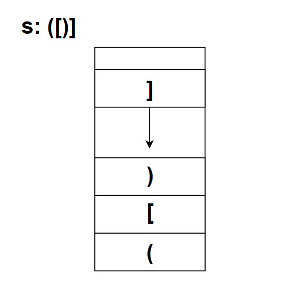
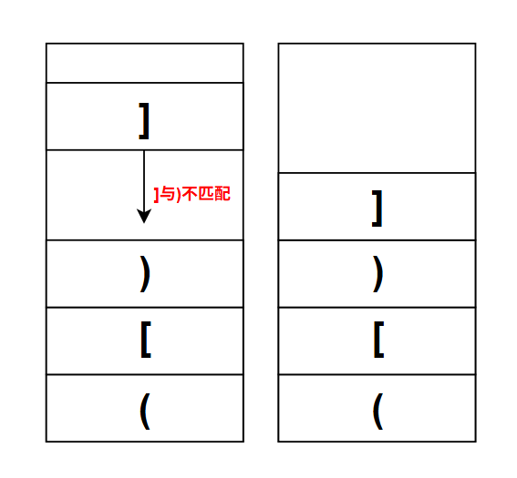
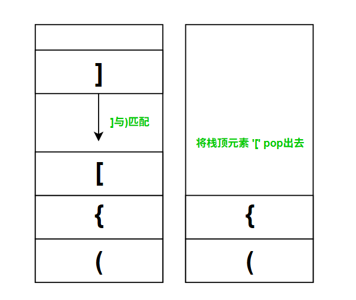

# 题目
### 20. 有效的括号

给定一个只包括 '('，')'，'{'，'}'，'['，']' 的字符串 s ，判断字符串是否有效。

有效字符串需满足：

左括号必须用相同类型的右括号闭合。
左括号必须以正确的顺序闭合。
每个右括号都有一个对应的相同类型的左括号。
 

示例 1：
```
输入：s = "()"

输出：true
```
示例 2：
```
输入：s = "()[]{}"

输出：true
```
示例 3：
```
输入：s = "(]"

输出：false
```
示例 4：
```
输入：s = "([])"

输出：true
```
示例 5：
```
输入：s = "([)]"

输出：false
```
 

提示：

1 <= s.length <= 104
s 仅由括号 '()[]{}' 组成

### 个人题解
开始的时候，我用的是一种比较传统的方法，即：当读取到括号的开始，对一个 `flag` 变量 +1，如果是括号的结束，则 -1

但由于范例 `([)]` 是不合法的，而用前面的这个方式会使这样的串判定为 true，造成漏解

因此，使用栈这种LIFO的数据结构是更好的选择



将各种括号的开始先push到栈内，当读到括号的结束，则判断当前栈顶的元素能否与当前的括号结束符匹配，若能则将当前栈顶元素出栈，否则就将当前元素压入栈中


*不匹配的情况*


*匹配的情况*

最终代码：
```c++
class Solution {
public:
    bool isValid(string s) {
        std::stack<char> runtime;
        if (s[0] == ')' || s[0] == ']' || s[0] == '}')
            return false;
        for (auto ch: s) {
            if (runtime.empty()) {
                runtime.push(ch);
                continue;
            }
            
            if (ch == ')' && runtime.top() == '(')
                runtime.pop();
            else if (ch == ']' && runtime.top() == '[')
                runtime.pop();
            else if (ch == '}' && runtime.top() == '{')
                runtime.pop();
            else runtime.push(ch);
        }
        
        return runtime.empty();
    }
};
```