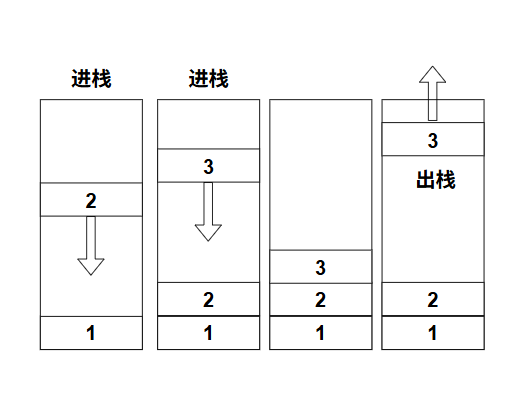
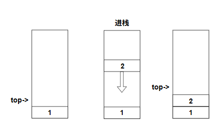
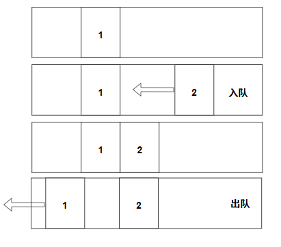
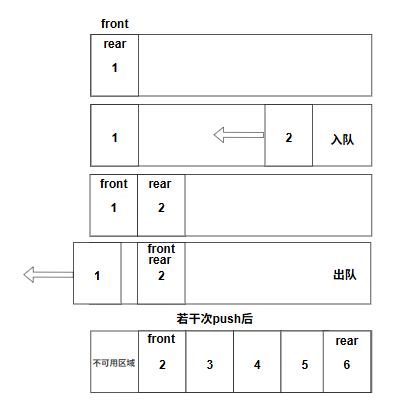

栈和队列都是表的一种，但是他们也有不同的地方

## 栈
栈是一个先进后出的结构


*栈结构的示意图*

我们实现栈的时候，有两种方法，一种是基于顺序表的实现方式；另一种是基于链表的实现方式

### 基于顺序表的实现方式
> [!WARNING]
> 本实现方式不考虑动态扩容的实现，使用的是容量固定的顺序表

和顺序表一样，我们需要指定基地址用于存放顺序表

同时，为了方便我们访问栈顶的元素并且能够对其进行一些操作，我们还需要一个 `top` 指针

```c++
class SeqStack {
    T* data = nullptr;
    T* top = nullptr;
}
```

接下来就是初始化，我们需要给我们的顺序表申请一块内存用于存放栈内的数据；至于 `top` 指针，直接让他指向当前的基地址即可（此时栈内没有数据）

```c++
SeqStack() {
    data = new T[MAX_SIZE];
    top = data;
}
```

之后，我们就需要实现栈的各种操作：`push`, `getTop` 和 `pop`:
#### push 操作
将元素压入栈中，之后让 `top` 指针指向当前的元素位置的下一个位置即可
```c++
void push(const T& value) {
    *(top ++) = value;
}
```

*当前 top指针实现的示意图*
> [!NOTE]
> 注意，此处的 `top` 是一个指针，进行 `++` 运算之后得到的结果还是一个指针\
> 而这行代码的意思是先对 `top` 对应的位置进行赋值，然后再使指针上移一位

#### getTop 操作
直接返回 `top` 指针指向的元素即可
```c++
T& getTop() {
    return *(top - 1);
}
```

### pop 操作
与 `push` 类似，但是这一次进行的是 `--` 运算
```c++
T pop() {
    return *(-- top);
}
```

### 基于链表的实现方式
对于这种实现方式，我们首先需要定义一个方便我们表示节点的结构，并且在这个栈中放置一个节点指针，方便指向栈的顶端
```c++
class LinkedStack {
    struct Node {
        T element;
        Node* next = nullptr;
    };

    Node* data = nullptr;
}
```
#### push 操作
基于链表的 `push` 操作较为简单，我们只需要初始化一个新的节点，并让这个节点的 `next` 指针指向当前的 `data` 即可
```c++
void push(const T& value) {
    Node* node = new Node {value, data};
    data = node;
}
```
当然，最后不能忘了更新我们的 `data`
#### getTop 操作
```c++
T& getTop() {
    if (!data)
        throw std::runtime_error("stack is empty!");

    return data->element;
}
```
直接进行获取即可，无需多言
#### pop 操作
对于这个操作，我们需要先将当前的节点指针提取出来，然后将 `data` 进行回退；之后才能释放对应节点的内存
```c++
void pop() {
    if (!data)
        throw std::runtime_error("stack is empty!");

    Node* ret = data;
    data = data->next;
    delete ret;
}
```

## 队列
队列与栈不同，它是一种先进先出的结构


*队列结构的示意图*

而和栈一样，队列也可以用两种方式实现，一个是基于顺序表的形式，另一个是基于链表的方式实现
### 基于顺序表的实现方式

顺序队列与之前的顺序栈类似，同样需要申请一块连续的内存用于存放数据；但是由于队列需要从队头删除元素，同时从队尾插入元素，因此我们需要使用两个下标分别表示队头和队尾的位置

```c++
class SeqQueue {
    T* data = nullptr;
    std::size_t front = 0;
    std::size_t rear = 0;

    const static int size = 10;
}
```

其中 `front` 表示当前队头的位置，而 `rear` 表示下一个可以插入元素的位置

初始化的时候，只需要申请一块内存，并让 `front` 和 `rear` 都指向 `0` 即可；此时队列为空

```c++
SeqQueue() {
    data = new T[size];
}
```

当我们向队列中加入元素时，需要将元素放入 `rear` 所指向的位置，之后让 `rear` 向后移动

但是这里有一个问题：当 `rear` 移动到数组末尾之后，就无法继续向后移动了；这个问题就是所谓的“假溢出”问题


*假溢出问题图示*

为了解决这个问题，我们可以让 `rear` 到达数组末尾之后重新回到数组开头，这样就形成了一个循环队列

当 `rear` 到达最后一个位置之后，再次移动就会回到数组的第一个位置

因此我们可以使用取模运算：

```c++
rear = (rear + 1) % size;
```

这样就可以让下标在 `0 ~ size - 1` 的范围内循环移动

#### getSize 操作

因为 `front` 和 `rear` 都可能处于数组的任意位置，因此不能简单地使用 `rear - front` 来计算队列长度

当 `rear` 位于 `front` 的前面时，直接相减就会得到一个负数

因此可以通过取模运算计算当前队列的大小

```c++
std::size_t getSize() {
    return (rear - front + size) % size;
}
```

这里加上 `size` 是为了避免 `rear - front` 得到负数

#### push 操作

向队列中加入元素时，首先需要判断队列是否已经满了

```c++
void push(const T& value) {
    if ((rear + 1) % size == front)
        throw std::runtime_error("queue full");

    data[rear] = value;
    rear = (rear + 1) % size;
}
```

这里有一个比较特殊的地方：我们并没有让队列真正使用数组中的全部空间

因此我们需要空出一个位置，用来区分队列为空和队列已满

当：

```c++
(rear + 1) % size == front
```

时，就表示队列已经满了

> [!NOTE]
> 由于需要空出一个位置，因此容量为 `size` 的数组实际上最多只能存放 `size - 1` 个元素

#### pop 操作

队列遵循先进先出的原则，因此删除元素时应该从 `front` 所指向的位置开始删除

由于我们使用的是顺序表，所以实际上并不需要真的删除这个元素，只需要让 `front` 向后移动即可

```c++
void pop() {
    if (rear == front)
        throw std::runtime_error("queue empty");

    front = (front + 1) % size;
}
```

这里同样使用了取模运算，使得 `front` 能够在数组中循环移动

#### head 操作

如果想要访问队头元素，直接访问 `front` 所指向的位置即可

就会成为新的队头元素

## 基于链表的实现方式

除了使用顺序表之外，队列也可以使用链表来实现

对于链式队列，我们需要两个指针：一个 `front` 指向队头，一个 `rear` 指向队尾

```c++
class LinkedQueue {
    struct Node {
        T element;
        Node* next = nullptr;
    };

    Node* front = nullptr;
    Node* rear = nullptr;
}
```

其中 `front` 用于删除元素，而 `rear` 用于添加元素

#### push 操作

由于队列是先进先出的结构，因此新的元素应该从队尾加入

首先判断当前队列是否为空

```c++
void push(const T& value) {
    if (front) {
        Node* node = new Node {value, nullptr};
        rear->next = node;
        rear = node;
    }
    else {
        front = new Node {value, nullptr};
        rear = front;
    }
}
```

如果当前队列不为空，那么只需要创建一个新的节点，然后让当前 `rear` 的 `next` 指向这个节点，最后更新 `rear`

如果当前队列为空，那么就不存在原来的队尾节点，因此需要同时更新 `front` 和 `rear`

```c++
front = new Node {value, nullptr};
rear = front;
```

#### pop 操作

由于队列遵循先进先出的原则，因此 `pop` 操作应该从 `front` 开始

首先需要判断队列是否为空

```c++
void pop() {
    if (!front)
        throw std::runtime_error("queue is empty!");

    Node* node = front;
    front = front->next;
    delete node;
}
```

这里首先保存当前的 `front`，然后让 `front` 指向下一个节点，最后释放原来的节点

#### head 操作

如果需要访问队头元素，那么直接访问 `front` 所指向的节点即可

```c++
T& head() {
    return front->element;
}
```

可以看到，虽然顺序栈和链式栈的底层实现方式不同，但是它们的核心思想都是后进先出；而顺序队列和链式队列虽然实现方式不同，但是都遵循先进先出的原则

对于顺序队列，我们主要利用两个下标和取模运算实现循环队列；而对于链式队列，则需要使用 `front` 和 `rear` 两个指针分别维护队头和队尾

需要注意的是，链式队列在删除最后一个元素之后，`front` 和 `rear` 都应该重新指向 `nullptr`，否则 `rear` 可能会继续指向已经被释放的节点
