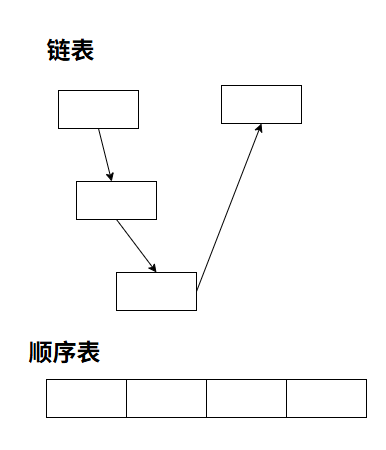
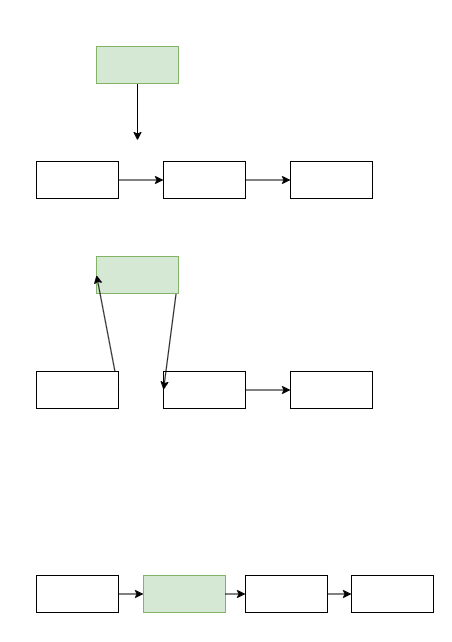
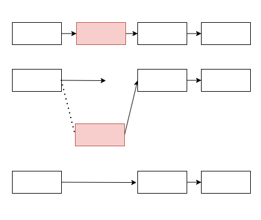
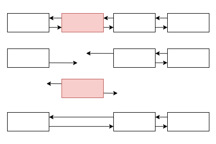
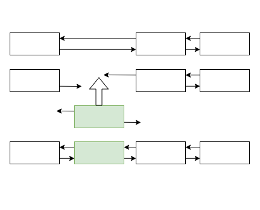

线性表，即由同种类型的元素组成的有限序列

在线性表中，对于某一个位置 `i` 处的元素；称 `i - 1` 处的元素为**直接前驱**，而 `i + 1` 处的元素为**直接后继**

```
  直接前驱  当前元素  直接后继
    |        |        |
[1, 2,       3,       4, 5]
```

针对线性表，有不同的几种实现方式：
### 一，顺序表
顺序表是通过借助一块连续的空间来达到储存和管理线性表的目的

所以，只要确定了顺序表的头位置，那么整个顺序表的各个位置都确定了，任一元素都可以随机进行存取；所以说顺序表是一个**随机存取**的结构

我们实现顺序表，将借用C++的指针来进行：
> [!NOTE]
> `typedef unsigned long long std::size_t`
```c++
template<typename T>
class SeqList {
    T* data = nullptr;
    std::size_t size = 0;
}
```
> [!NOTE]
> 为什么使用 `T*` ?
> 如果你研究过C++的数组，你会发现：`&arr` 和 `&arr[0]` 其实是相同的一段地址
> 这是因为，C++的数组本质上是一个指针，而要访问数组的各个元素则是通过让指针偏移的方式来进行的
> e.g.
> 我们所看到的：`arr[1]` 实际上就是：`*(arr + 1)`

接下来，我们就要开始实现表的各种操作了
#### 1.初始化
```c++
SeqList(std::initializer_list<T> list) {
    size = list.size();
    data = new T[list.size()];

    std::size_t i = 0;
    for (auto it = list.begin(); it != list.end(); it ++) {
        data[i] = *it;
        i ++;
    }
}
```
首先，我们要给我们的 `data` 申请一块内存，大小应该刚好是传进来的初始化列表

之后的for循环，便是将初始化列表内的元素全部赋到我们的顺序表中
#### 2.查找操作
```c++
std::size_t find(const T& value) {
    for (std::size_t i = 0; i < size; i ++) {
        if (data[i] == value) return i;
    }
    throw std::runtime_error("cannot find");
}
```
我们需要让用户指定一个目标值，让 `find` 方法在 `data` 中搜索是否存在目标值，如果不存在目标值，则要抛出异常

而如果找到目标值了，直接返回目标值对应的索引即可
#### 3.取值操作
```c++
T& at(std::size_t index) {
    if (index >= size)
        throw std::out_of_range("");

    return data[index];
}
```
这里的实现参考了STL中的 `at` 方法的实现，即：当给出的索引大于当前顺序表的最大索引的时候，抛出异常

而如果检查无误，直接返回对应的值即可
#### 4.插入操作
> [!WARNING]
> 本顺序表实现的插入是后向插入

```c++
void insert(std::size_t index, const T& value) {
    if (index >= size)
        throw std::out_of_range("");

    T* tmpData = new T[size + 1];

    for (std::size_t j = 0; j < index; ++j) {
        tmpData[j] = data[j];
    }

    tmpData[index] = value;

    for (std::size_t j = index; j < size; ++j) {
        tmpData[j + 1] = data[j];
    }

    delete[] data;
    data = tmpData;
    size ++;
}
```
很明显，`insert` 方法要比前面的方法复杂很多

首先要注意，要求插入的位置必须是合法的；和前面的 `at` 方法一样，需要判断位置是否合法，如果是不合法的位置，需要抛出异常

很明显，插入后的顺序表大小会比旧的顺序表大小多1一个元素，所以我们需要进行扩容

这里的方法是重新分配一个新的空间，将原有的元素全部移动过去并将新的值放在对应的位置（7-15行）

之后，我们需要将原有的空间，即 `data` 指向的那一块内存进行销毁，随后我们让 `data` 指向我们新申请的这一块内存即可

最后，需要让 `size++`，否则后续相关功能会出现错误

#### 5.删除操作
```c++
void erase(std::size_t index) {
    if (index >= size)
        throw std::out_of_range("");

    T* tmpData = new T[size - 1];

    for (std::size_t j = 0; j < index; ++j) {
        tmpData[j] = data[j];
    }

    for (std::size_t j = index + 1; j < size; ++j) {
        tmpData[j - 1] = data[j];
    }

    delete[] data;
    data = tmpData;
    size --;
}
```
删除操作的大部分内容和上一个插入操作是差不多的，唯一需要注意的是这一次是删除对应位置的元素，所以我们移动的时候跳过目标元素即可，同时保证 `size --`

### 二，链表
链表也需要一个头指针来存储后续的数据，但是与顺序表不同，链表中各个元素的位置高度依赖每个节点的 `next` 指针；这个指针的作用就是指向下一个节点，用于获得各个节点的位置

所以，链表存储的空间是不连续的


*顺序表和链表的区别*

链表也分多种，本文主要介绍单链表和双链表
#### 1.单链表
对于单链表，每一个节点如其名，只有一个指针，即 `next`
```c++
template<typename T>
class SingleList {
    struct ListNode {
        T element;
        ListNode* next = nullptr;
    }

    ListNode* head = nullptr;
    int listSize = 0;
};
```
为了保证指针能正常参与判断，我们默认让指针指向空地址

##### 初始化
```c++
SingleList(std::initializer_list<T> list) {
    if (list.size() == 0) return;

    head = new ListNode;
    head->element = *list.begin();
    ListNode* curNode = head;
    for (auto it = list.begin() + 1; it != list.end(); it ++) {
        curNode->next = new ListNode;
        curNode->next->element = *it;
        curNode = curNode->next;
    }
    listSize = list.size();
}
```
这里我们依旧借助初始化列表，我们将初始化列表的第一个元素放置在头节点，后续元素则按顺序依次初始化并赋值

##### 查找操作
这里，涉及到链表的遍历

事实上，链表有两种遍历方式：递归和循环
###### 基于递归的方式：
```c++
bool has(T e, ListNode* node) {
    if (node->element == e) return true;
    else if (node->next) {
        return has(e, node->next);
    }
    else return false;
}

bool has(T e) {
    if (head->element == e) return true;
    else if (head->next) {
        return has(e, head->next);
    }
    else return false;
}
```
> [!WARNING]
> 上述递归实现显然不是最好的，可以将第一个版本的 `has` 函数的node参数进行合并并指定初始值 `nullptr`以避免多开函数

这个方式就是先从头节点开始进行搜索，如果找到了直接返回 `true`，而如果没找到则调用 `has(T e, ListNode* node)`，将当前遍历到的节点传入并进行下一个方法调用

###### 基于循环的方式：
```c++
bool ehas(T e) {
    ListNode* curNode = head;
    while (curNode) {
        if (curNode->element == e) return true;
        curNode = curNode->next;
    }
    return false;
}
```
这个方式明显会更好理解一点

这个方式利用了一个 `curNode` 的中间变量，当如果没找到目标节点的时候，就将这个变量设置为当前节点的 `next` 指针指向的节点

如果 `curNode` 为空，则说明找不到指定的节点，就要返回 `false`

##### 取值操作
```c++
T& at(int index) {
    ListNode* curNode = head;
    std::size_t i = 0;
    while (curNode) {
        if (i == index) return curNode->element;
        curNode = curNode->next;
        i ++;
    }
    throw std::runtime_error("cannot find");
}
```

这里的取值方法就是用的循环的方法进行，当遍历到给定的索引的时候就返回对应索引的元素

##### 插入操作
> [!WARNING]
> 本链表实现的插入是后向插入

```c++
void insert(int index, T e) {
    ListNode* curNode = head;
    std::size_t i = 0;
    while (curNode) {
        if (i == index) {
            ListNode* newNode = new ListNode;
            newNode->element = e;
            ListNode* after = curNode->next;
            curNode->next = newNode;
            newNode->next = after;
            listSize ++;

            return;
        }
        curNode = curNode->next;
        i ++;
    }
    throw std::runtime_error("cannot insert");
}
```

针对链表的插入，需要格外注意；要将目标位置的前一个节点的 `next` 指针指向新的节点，新的节点的 `next` 指针指向原来的后一个节点


*单链表插入的示意图*

所以，我们将目标节点指向后继的指针进行了临时储存：
```c++
ListNode* after = curNode->next;
```

然后再将新的节点的 `next` 指针指向这个“原来的后继”

```c++
newNode->next = after;
```
##### 删除操作
```c++
void erase(int index) {
    ListNode* curNode = head;
    ListNode* prev = nullptr;

    for (int i = 0; i < index; ++i) {
        prev = curNode;
        curNode = curNode->next;
    }

    if (prev)
        prev->next = curNode->next;
    else
        head = curNode->next;

    delete curNode;
    listSize --;
}
```
单链表的删除也是一样需要在 `next` 指针这里做文章，不同的是，这里需要将目标节点前驱的 `next` 指针指向目标的直接后继，跳过目标节点本身


*单链表删除的示意图*

#### 2.双向链表
双向链表，顾名思义，它的节点有两个指针，一个指针指向自己的直接前驱，另一个指向直接后继：
```c++
struct ListNode {
    T element;
    ListNode* prev = nullptr;
    ListNode* next = nullptr;
};
```
因此，双向链表的大部分内容都和单链表相似：
```c++
template<typename T>
struct DoubleList {
private:
    struct ListNode {
        T element;
        ListNode* prev = nullptr;
        ListNode* next = nullptr;
    };

    ListNode* head = nullptr;
    int listSize = 0;
public:
    DoubleList()=default;
    DoubleList(std::initializer_list<T> list) {
        if (list.size() == 0) return;

        head = new ListNode;
        head->element = *list.begin();
        ListNode* curNode = head;
        ListNode* prevNode = nullptr;
        for (auto it = list.begin() + 1; it != list.end(); it ++) {
            curNode->next = new ListNode;
            curNode->next->prev = curNode;
            curNode->next->element = *it;
            curNode = curNode->next;
        }
        listSize = list.size();
    }

    ~DoubleList() {
        if (!head) return;
        else {
            ListNode* curNode = head;
            while (curNode) {
                head = curNode->next;
                delete curNode;
            }
        }
    }

    bool has(T e) {
        ListNode* curNode = head;
        while (curNode) {
            if (curNode->element == e) return true;
            curNode = curNode->next;
        }
        return false;
    }

    bool find(T e) {
        ListNode* curNode = head;
        while (curNode) {
            if (curNode->element == e) return true;
            curNode = curNode->next;
        }
        return false;
    }

    T& at(int index) {
        ListNode* curNode = head;
        std::size_t i = 0;
        while (curNode) {
            if (i == index) return curNode->element;
            curNode = curNode->next;
            i ++;
        }
        throw std::runtime_error("cannot find");
    }

    void insert(int index, T e) {
        ListNode* curNode = head;
        std::size_t i = 0;
        while (curNode) {
            if (i == index) {
                ListNode* newNode = new ListNode;
                newNode->element = e;
                ListNode* after = curNode->next;
                curNode->next = newNode;
                newNode->prev = curNode;
                newNode->next = after;
                if (after)
                    after->prev = newNode;
                listSize ++;

                return;
            }
            curNode = curNode->next;
            i ++;
        }
        throw std::runtime_error("cannot insert");
    }

    void erase(int index) {
        ListNode* curNode = head;

        for (int i = 0; i < index; ++i) {
            curNode = curNode->next;
        }

        if (curNode->prev)
            curNode->prev->next = curNode->next;
        else
            head = curNode->next;

        if (curNode->next)
            curNode->next->prev = curNode->prev;

        delete curNode;
        listSize --;
    }
};
```
对于上述代码，大部分原理都和单链表处相似

唯一不同的就是插入和删除时的操作，在双链表中，需要同时对 `next` 和 `prev` 进行设置


*双向链表删除的示意图*


*双向链表插入的示意图*

### 三，两种线性表实现方式的比较
顺序表的空间是连续的，如果要进行插入或者删除，可能会导致空间上的变化
> [!NOTE]
> 事实上，顺序表有一个最明显的例子就是 `std::vector`
> 对于 `std::vector`，它的实现比本文所写的 `SeqList` 要更精妙；它主要借助另一个关键成员 `_capacity` 和C++的 `std::allocator` 进行实现
> 不过关于这个的更多细节后面会专门写一篇文章进行分析和学习

而对于链表，由于它的组织性质，导致其它的插入和删除操作只需要修改指针即可，时间复杂度仅为 $O(1)$

所以，综上所述：
- 如果线性表需要频繁的插入和删除，使用链表
- 否则应该考虑使用顺序表