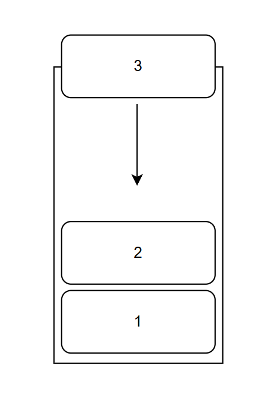
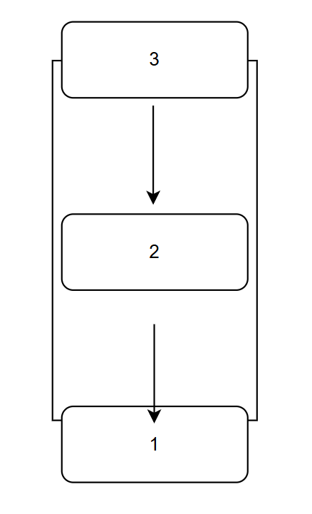
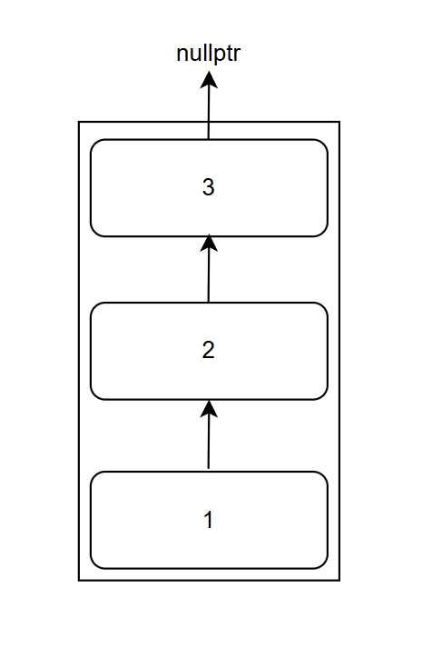
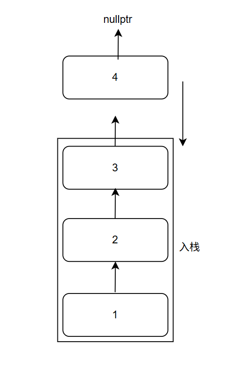

# ADT：栈
栈是一种 **先进后出** 的数据结构，它跟队列比较相似



****上面的图表示栈****



****上面的图表示一个队列****

可以很容易的观察出来，对于队列 `queue` 元素是先进先出的，这样一个“通道”是双端打开的

对于栈 `stack` ，元素是先进后出的，第一个进去的元素被放在了栈的最底端，最后进去的元素被放在了栈的最顶端，这样一个“通道”是只开了一个“门”的

而对于栈的实现，有两种方式：一种是利用单链表来进行实现，另一种则是借助数组来进行实现

## 基于单链表的栈

单链表的栈大概是这个样子的：



根据上图，我们很容易写出这样的一个结构来表示栈：
```c++
struct Node {
    int val;
    Node* next = nullptr;

    Node(int v): val(v) {}
    void append(int v) {
        next = new Node(v);
    }
};

struct Stack {
    Node* root = nullptr; // 栈底

    Stack(int root_val) {
        root = new Node(root_val);
    }
    Stack()=default;
};
```
可以观察到，在这个定义中，这样的基于单链表的栈依赖于一个 **root**，也就是这个栈的根基，一个单链表需要一个根节点来进行后续的延申，而对于基于单链表实现的栈来说，情况是一样的

接下来，我们将定义若干个方法：`Top`, `Push`, `Pop` 来对这样一个栈进行最基本的操作

### `Top` 方法
```c++
int Top() {
    Node* ptr = root;
    while (ptr->next != nullptr) {
        ptr = ptr->next;
    }
    return ptr->val;
}
```
栈的 `Top` 方法是用来获得顶层的元素，所以，我们需要对这个单链表遍历

当当前节点的 `next` 指针为 `nullptr` 的时候，这就说明这个元素的**上方**不在有其他的元

也就是说明，这个元素就是这个“栈”最顶端的元素（事实上，根据前面给出的示意图，也可以看出来所谓的“栈顶元素”其实就是 `next` 指针为 `nullptr` 的元素）

### `Push` 方法
`Push` 方法的目的是要将一个元素压入栈中，因此，我们这样实现：
```c++
Stack& Push(int v) {
    Node* ptr = root;

    if (!ptr) {
        ptr = new Node(v);
        root = ptr;
        return *this;
    }

    while (ptr->next != nullptr) {
        ptr = ptr->next;
    }
    ptr->next = new Node(v);

    return *this;
}
```
栈的 `Push` 方法的本质则是利用前面的 `Top` 元素，也就是令最顶上的元素的 `next` 指针指向要加入的新元素



如上图所示，这个新加入的元素的 `next` 将是 `nullptr` ，它将成为新的栈顶

### `Pop` 方法
`Pop` 方法是用来弹出栈顶元素，对于这个栈的实现来说，也就是将在栈顶下面的那个元素的 `next` 指针指向 `nullptr`：
```c++
void Pop() {
    Node* ptr = root;
    while (ptr->next->next != nullptr) {
        ptr = ptr->next;
    }
    delete ptr->next;
    ptr->next = nullptr;
}
```
可以看到，这里依旧用遍历的办法将这个栈顶的元素“弹出”（实质是前一个ListNode对后一个ListNode的解绑）

## 基于数组的栈
相对于基于单链表的栈，基于数组的栈则要简单很多：
```c++
template<std::size_t size>
struct Stack {
    std::array<int, size> array;
    int counter = 0;

    Stack() {
        array.fill(-1);
    }
};
```
可以看到，一个基于数组实现的栈中，有两个关键成员：一个是数组本身 `array`，还有一个则是代表栈顶的计数器 `counter`

当然，对于这个栈，我们也会有 `Top`，`Push`，`Pop` 三种方法

### `Top` 方法
对于基于数组的栈来说，`Top` 方法的实现比基于单链表的栈要简单很多：
```c++
int Top() {
    return array[counter];
}
```
没有复杂的循环遍历，有的只是一行简洁的return语句，事实上，这个 `counter` 就是当前有效数组的长度

### `Push` 方法
```c++
void Push(int element) {
    // 检查有没有超过数组上限
    if (counter >= array.size()) {
        std::cout << "Space enough!" << std::endl;
        return;
    }
    array[counter ++] = element;
}
```
对于 `Push` 方法，基于数组的栈就需要**小心**了，因为数组是静态数组（可以看到，我们使用的是 `std::array` 而不是 `std::vector`）

因此，在进行Push之前，我们需要检查一下当前的counter有没有超过整个数组的上限，如果超过了，就需要报错并停止操作

### `Pop` 方法
```c++
void Pop() {
    counter --;
    array[counter] = -1;
}
```
`Pop` 方法的实现也很简单，只需要先将这个计数器减去1，再对这个计数器对应的元素进行操作即可（刚才说过，counter实质应该是有效数组的长度，所以这里需要先操作： `counter --` 才能进行后面的赋值，否则就会 `out_of_range`）

## 两种方法的对比
不需要过多的测试，我们很清楚的可以发现使用数组实现的栈的时间花费比基于单链表实现的栈的时间花费小得多，因此，更多使用基于数组实现的栈而不是单链表实现的栈