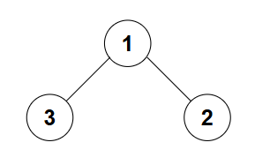
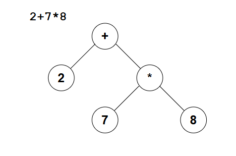
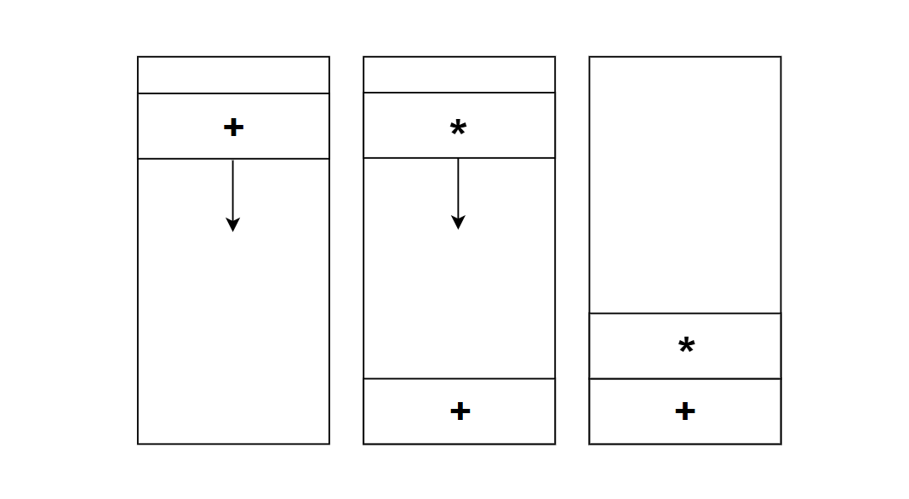
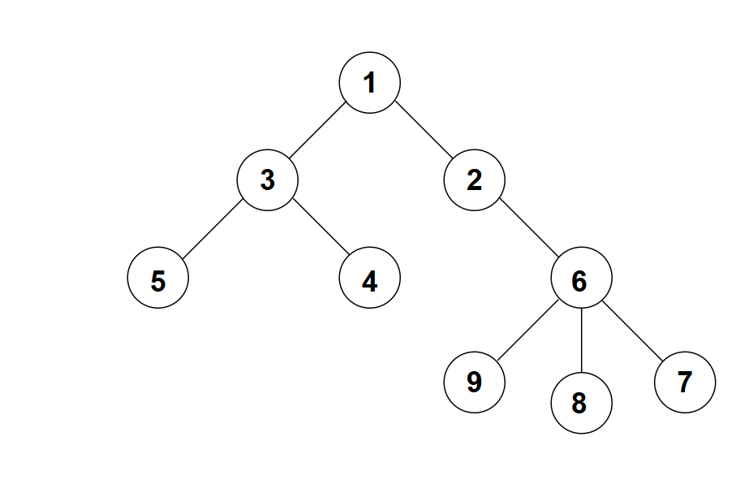
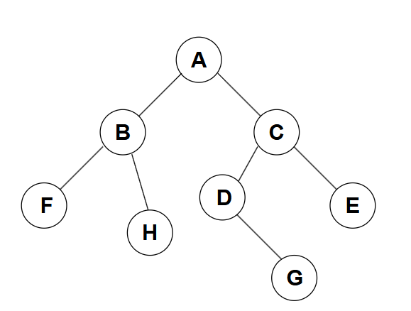
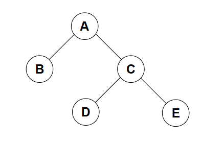
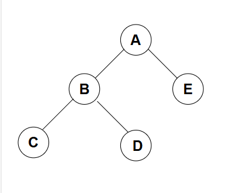
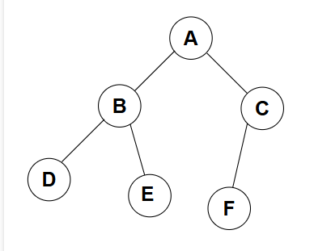

# 二叉树
## 概论
二叉树，顾名思义，一个节点下只能最多有两个子节点：


而它在C++的实现一般是这样的：
```c++
struct BinaryNode {
    int val;
    BinaryNode* left = nullptr;
    BinaryNode* right = nullptr;

    BinaryNode(int v): val(v) {}
};
```
一个二叉树的节点，其内存在两个指向节点的指针：`left` 和`right`，用于代指两边的节点
## 二叉树的一个应用：二元表达式解析
事实上，二叉树在解析二元表达式上有很大的优势，在表达式树中，树叶为**操作数**，而其它节点则为**操作符**，如下图例子所示


而为了能够很好的解析这样的二元表达式，我们将使用中缀表达式（逆波兰表达式）来进行这样的操作

### 逆波兰表达式
逆波兰表达式是一种有利于计算机进行处理的表达式表示方式，举个例子：

$$\text{1 + 2 * 3} \quad \longrightarrow \quad \mathbf{1\ 2\ 3\ * +}$$

而它的处理方式则是用栈的方式，将操作符压入栈中，再根据优先级进行判断是否出栈

让我们对上面给出的例子进行说明：

1. 从左向右扫描表达式串
2. 扫描到 `1`，加入到结果串中
3. 扫描到 `+`，操作符入栈
4. 扫描到 `2`，加入到结果串中
5. 扫描到 `*`，优先级大于 `+`，压入栈中
6. 扫描到 `3`，加入到结果串中
7. 源串结束，将栈中的操作符依次弹出并加入到结果串中

其中，对于入栈的流程，我们用下图表示：



最终便得到了我们的结果串：`1 2 3 * +`

同样的：

$$\text{1 + 2 + 7 * 9 - 3} \quad \longrightarrow \quad \mathbf{1\ 2\ + \ 7\ 9\ * \ + \ 3\ -}$$

### 利用逆波兰表达式构造表达式树
我们利用逆波兰表达式构造表达式树，就是要对得到的逆波兰表达式串进行扫描再构建，代码如下：
```c++
void binaryExprConstruct(std::string expr) {
    std::stack<BinaryNode<char>*> runtime;
    for (auto ch: expr) {
        if (isdigit(ch))
            runtime.push(new BinaryNode(ch));
        else {
            auto right = runtime.top(); runtime.pop();
            auto left = runtime.top(); runtime.pop();
            auto node = new BinaryNode(ch);
            node->left = left;
            node->right = right;
            runtime.push(node);
        }
    }

    runtime.top()->preorderTraversal();
}
```
需要注意的是，上述方法的参数 `expr` 是逆波兰表达式而不是我们熟知的自然表达式

在构造这样一个表达式树的时候，直接将数字压入栈中；而对于符号，弹出栈中的两个元素（必定为数字），再分别插入到新构建的 `node` 的 `left` 和 `right` 两个子节点中；最后将这个指针压入栈中即可

## 二叉树的遍历
前面说过，遍历分两种，先序遍历和后序遍历，其中，我们将第三种：中序遍历给省略掉了

而在二叉树的遍历中，我们将再次讨论这三种遍历方式

核心问题：X序遍历，是以谁为顺序的？答案是对根节点的访问顺序

而在树中，还遵循从左向右的访问顺序，例如在同一层中，最左边的节点往往先被访问

例如上图中第三层 `5` `4` `6`三个节点，他们的访问顺序就是从左到右来的

那么，对于如下的树，我们进行讨论：


### 先序遍历
先序遍历就是先访问根节点，再依次访问其下的所有直接子节点

例如，对于上面的树，如果我们采用先序遍历，那么遍历顺序会是：

$$ A \rightarrow B \rightarrow F \rightarrow H \rightarrow C \rightarrow D\rightarrow G\rightarrow E  $$
### 中序遍历
中序遍历就是按照从左往右的顺序进行访问，无论节点关系是子还是父

若我们对上面的树采用中序遍历，顺序应该是：

$$ F\rightarrow B \rightarrow H \rightarrow A \rightarrow D \rightarrow G \rightarrow C \rightarrow E $$

注意到上面的
$$ D \rightarrow G $$
部分，完整的来讲，由于 $D$ 缺少了它的左子节点 $D_{left}$，所以直接遍历到了 $D$，否则，完整的遍历应该是：
$$ ... \rightarrow A \rightarrow D_{left} \rightarrow D \rightarrow G \rightarrow ... $$

### 后序遍历
后序遍历就是优先按照从左至右的顺序访问子节点，最后访问根节点

对于上述的例子，后序遍历顺序应该如下：
$$ F \rightarrow H \rightarrow B \rightarrow G \rightarrow D \rightarrow E \rightarrow C \rightarrow A $$

其中，关于 $D_{left}$ 的部分同上面的中序遍历的解析，如果存在 $D_{left}$，那么它的解析顺序应该是：
$$ ... \rightarrow B \rightarrow D_{left} \rightarrow G \rightarrow D \rightarrow ... $$

## 基于遍历序列构造二叉树
首先我们需要知道，仅给出一种遍历序列（先序，中序，后序）是**无法**得出一个二叉树的结构的

例：
如果有先序遍历：
$$ A \rightarrow B \rightarrow C \rightarrow D \rightarrow E $$
那么我们可以确定树为：



或者是



针对其它的遍历序列，道理也是一样的

因此，我们必须要有两种及以上的遍历序列才能得到一个准确的二叉树

通常情况下，我们需要 **中序遍历** 加上 **先序遍历** 或 **后序遍历** 中的一种来唯一确定一棵二叉树

### 利用 先序遍历 + 中序遍历 构造
**核心思想**：
1. **先序遍历**的第一个节点一定是当前的**根节点**
2. 在**中序遍历**中找到这个根节点，那么该节点左边的所有节点属于**左子树**，右边的所有节点属于**右子树**
3. 根据中序遍历中左子树节点的数量，我们可以在先序遍历中确定左子树和右子树的范围
4. 对左右子树递归执行上述步骤

**例子**：
假设我们有：
*   先序：`A B D E C F`
*   中序：`D B E A F C`

**推导过程**：
1.  先序第一个是 `A`，所以根是 `A`
2.  在中序中找到 `A`，将其分为两部分：`[D B E] A [F C]`。
    *   左子树节点集合：`{D, B, E}`，长度为 3
    *   右子树节点集合：`{F, C}`，长度为 2
3.  回到先序序列，根据长度划分：
    *   `A` 后面紧跟的 3 个节点 `B D E` 属于左子树
    *   剩下的 `C F` 属于右子树
4.  **递归构建左子树**：
    *   子先序：`B D E`，子中序：`D B E`。
    *   根为 `B`。中序中 `B` 左边是 `D`，右边是 `E`。
    *   所以 `B` 的左孩子是 `D`，右孩子是 `E`。
5.  **递归构建右子树**：
    *   子先序：`C F`，子中序：`F C`。
    *   根为 `C`。中序中 `C` 左边是 `F`，右边为空
    *   所以 `C` 的左孩子是 `F`，无右孩子

最终得到的树结构如下：



相关代码：
```c++
BinaryNode<char>* preInBuild(std::string preorder, std::string inorder) {
    if (preorder.empty()) return nullptr;

    char rootVal = preorder[0];
    auto root = new BinaryNode<char>(rootVal);

    int split = inorder.find(rootVal);

    root->left = preInBuild(preorder.substr(1, split), inorder.substr(0, split));
    root->right = preInBuild(preorder.substr(1 + split), inorder.substr(split + 1));

    return root;
}
```

### 利用 后序遍历 + 中序遍历 构造
**核心思想**：
逻辑与上述类似，唯一的区别在于：**后序遍历**的**最后一个节点**是当前的**根节点**

**例子**：
*   后序：`D E B F C A`
*   中序：`D B E A F C`

**推导过程**：
1.  后序最后一个是 `A`，确定根为 `A`
2.  在中序中找到 `A`：`[D B E] A [F C]`
    *   左子树长度 3，右子树长度 2
3.  在后序中划分（注意后序是 `左->右->根`）：
    *   最前面的 3 个 `D E B` 是左子树的后序序列
    *   紧接着的 2 个 `F C` 是右子树的后序序列
4.  递归处理...

相关代码：
```c++
BinaryNode<char>* postInBuild(std::string postorder, std::string inorder) {
    if (postorder.empty()) return nullptr;

    char rootVal = postorder.back();
    auto root = new BinaryNode<char>(rootVal);

    int split = inorder.find(rootVal);

    root->left = postInBuild(postorder.substr(0, split), inorder.substr(0, split));
    root->right = postInBuild(postorder.substr(split, postorder.size() - 1 - split), inorder.substr(split + 1));
    return root;
}
```
### 为什么 "先序 + 后序" 通常不行？
因为先序（根-左-右）和后序（左-右-根）都只能告诉我们**根节点**是谁（先序第一个，后序最后一个），但它们**无法区分左右子树的边界**

例如：
*   先序：`A B`
*   后序：`B A`

这棵树可能是：
1.  `A` 是根，`B` 是 `A` 的左
2.  `A` 是根，`B` 是 `A` 的右孩子
   
综上，如果要通过遍历序列确定树的结构，必须要有中序遍历的序列；而先序遍历和后序遍历的序列用于确定边界和确定根节点用
