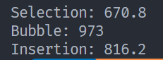
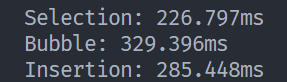

# 简单排序
#### 本文主要介绍以下几种排序方式：
- 选择排序
- 冒泡排序
- 插入排序

## 选择排序


*演示图来自于 [菜鸟教程](https://www.runoob.com/)*

### 思路：
**基本思想：** 从待排序序列中选出**最小**元素放到已排序序列的末尾

**步骤**
1. 将整个序列分为已排序和待排序部分，初始的时候，已排序序列长度应该为0
2. 对整个序列进行遍历，将最小元素追加到待排序序列中
3. 重复步骤**2**，直到待排序序列长度为0

### 代码实现（CPP）：
```c++
void SelectionSort() {
    std::vector<int> arr = {1, 3, 5, 2, 90, 45, 99, 103, 4566, 12, 4, 77, 9090, 3030, 2020, 4040};
    for (auto it = arr.begin(); it != arr.end() - 1; ++it) {
        std::iter_swap(it, std::min_element(it, arr.end()));
    }
}
```

针对上述代码，采用了标准库中的函数进行处理使过程更加简单

### 时间复杂度

- 最坏情况：$O(n^2)$ 无论给出的数据是否有序，都需要 $\frac{n(n-1)}{2}$ 次比较
- 最好情况：$O(n^2)$ 对于给出的代码，可以将 `std::min_element()` 方法也看成一个for循环，无论什么情况依旧需要 $O(n^2)$ 的时间复杂度
- 平均情况：$O(n^2)$

### 空间复杂度

$O(1)$

由于不需要额外的空间，整个排序过程均在 `arr` 中进行，所以空间复杂度是 $O(1)$

---
## 冒泡排序


*演示图来自于 [菜鸟教程](https://www.runoob.com/)*

### 思路：
**基本思想：** 对相邻的两个元素进行比较，大的靠后，小的靠前

**步骤**
1. 从第一个元素开始比较相邻的两个元素，如果前一个元素大于后一个元素，则两个元素互换位置
2. 忽略已排序部分，并重复上述步骤，直到排序完成

### 代码实现（CPP）：
```c++
void BubbleSort() {
    std::vector<int> arr = {1, 3, 5, 2, 90, 45, 99, 103, 4566, 12, 4, 77, 9090, 3030, 2020, 4040};
    
    bool flag = true;
    while (flag) {
        flag = false;
        for (auto it = arr.begin(); it != arr.end() - 1; it ++) {
            if (*it > *(it + 1)) {
                flag = true;
                std::iter_swap(it, (it + 1));
            }
        }
    }
}
```

上述代码核心是一个 `flag` 变量，当进行了一次置换之后，说明排序仍未结束，所以应该继续排序，所以 `flag = true`

### 时间复杂度

- 最坏情况：$O(n^2)$ 当整个序列都是逆序的时候，需要每一次都进行判断
- 最好情况：$O(n)$   当序列本身具有顺序，不需要判断，只需要一次循环即可
- 平均情况：$O(n^2)$ 

### 空间复杂度

$O(1)$

没有使用新的空间，而是基于原有数组的操作

---
## 插入排序


*演示图来自于 [菜鸟教程](https://www.runoob.com/)*

### 思路：
**基本思想：** 构建已排序序列和待排序序列，从待排序序列中选出元素并插入对应的已排序序列的位置中

**步骤**
1. 将整个序列分为已排序和待排序部分，初始的时候，已排序序列部分只有首项一个元素
2. 选取待排序序列的第一个元素
3. 遍历已排序序列中，查找适合这个元素的位置并置入
4. 重复步骤 2~3，直到排序结束

### 代码实现（CPP）：
```c++
void InsertionSort() {
    std::vector<int> arr = {1, 3, 5, 2, 90, 45, 99, 103, 4566, 12, 4, 77, 9090, 3030, 2020, 4040};

    for (std::size_t i = 0; i < arr.size(); i ++) {
        int tmp = arr[i];
        int j = i - 1;
        while((j >= 0) && (tmp < arr[j])) {
            arr[j + 1] = arr[j];
            j --;
        }
        arr[j + 1] = tmp;
    }
}
```

### 时间复杂度

- 最坏情况：$O(n^2)$ 当整个序列都是逆序的时候，需要每一次都进行判断
- 最好情况：$O(n)$   当序列本身具有顺序，不需要判断，只需要一次循环即可
- 平均情况：$O(n^2)$ 

### 空间复杂度

$O(1)$

没有使用新的空间，而是基于原有数组的操作

## 三种排序的时间比较
小数据集（即示例给出的 `arr`）：



*单位：微秒*

大数据集（5000个1-10000的整数）：

