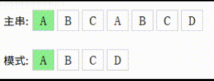

涉及到字符串的模式匹配问题，常用的算法就是BF算法和KMP算法

下面对这两个算法进行介绍和代码实现

## BF（Brute Force）算法
BF算法最容易理解，也是最暴力的方法

简单来说，就是从模式串中一个字符一个字符地进行比较

当发现不匹配的时候，回退到模式串开头并重新匹配


*BF 算法示意动图*

那么我们可以写出代码：
```C++
int BFSearch(std::string source, std::string pat) {
    if (source.size() < pat.size()) return -1;

    int j = 0;
    for (int i = 0; i <= source.size() - pat.size(); i ++) {
        j = 0;
        while (source[i + j] == pat[j] && j < pat.size()) {
            j ++;
        }
        if (j == pat.size()) return i;
    }

    return -1;
}
```
首先，匹配需要保证我们的源串长度大于模式串长度，否则在后续匹配的 `source.size() - pat.size()` 会出现问题

之后，我们维护一个变量 $j$，它表示当前模式有多少个字符是匹配的；举个例子：

当有情况：
```
source: ABCDABC
pat:    ABD
```
那么进行匹配到 `source[2]` 的时候，此时由于源串的前两个字符 `AB` 和模式串的前两个字符是匹配的，所以此时有 $j = 1$ 

而对于这个循环，只要 $j$ 指示的对应模式的字符和源串对应位置的字符是相等的，就说明匹配成功，此时也就有 $j = j + 1$

> [!NOTE]
> 对于 $source[i + j]$，这里的 $j$ 可以看作是一个相对于当前源串指针 $i$ 的一个偏移量

最后，如果这一次 **for** 循环中，$j$ 满足 $j = pat.size()$，就说明模式被完全匹配，那么就可以返回最开始匹配的索引 $i$

## KMP算法
注意到BF算法有一个弊端：只要模式有不匹配的部分就会将整个匹配进度回退到开头；但是有的模式串有一些相同的部分，在确定这部分是匹配的情况下，直接将整个进度回退到开头会造成一些时间上的损失；为了让整个查找过程更加的迅速，更好的方案是使用KMP算法

很明显，对于一个模式串，其重复的那一部分如果被匹配到了，之后如果发生了模式失配，没有必要像BF算法一样将整个匹配进度回退，而是应该查找是否有一部分可以直接作为下一轮匹配的开头，并继续匹配

这时候，我们需要维护一个数组 $next$，用于计算当模式失配的时候我们应该将匹配进度回退到何处

为了更好地介绍如何建立 $next$ 数组，现在介绍下面的一些概念：

#### 相同前后缀

一个字符串肯定存在多个前缀和后缀：
```
ABCDA

前缀：
A
AB
ABC
ABCD

后缀：
A
DA
CDA
BCDA
```
而有的时候，会发生前后缀相同的情况：
```
ABABA

前缀：
A
AB
ABA
ABAB

后缀：
A
BA
ABA
BABA
```
不难发现，对于上面的例子，存在相同的前后缀：`A` 和 `ABA`

而我们前面提到的 “一部分可以直接作为下一轮匹配的开头”；这里的 “一部分” 便是指的这些相同的前后缀

由此，我们给出 $next$ 数组的定义：

$$
next[i] \space 表示子串\space s[0...i] \space 的最长相等前后缀长度
$$

举个例子：
```
pat: ABABC
```
对于上面这个模式，我们计算其 $next$ 数组：
$$
next[0] = 0 \tag{1}
$$
这是默认的

而很明显，当 $i = 1$ 的时候，也不存在相等的前后缀，所以：
$$
next[1] = 0 \tag{2}
$$
当 $i = 2$ 的时候，情况发生变化，此时出现了相同的前后缀 `A`，除此之外找不到更长的相等前后缀了，所以：
$$
next[2] = 1 \tag{3}
$$
当 $i = 3$ 的时候，出现了相同的前后缀 `AB`，除此之外找不到更长的相等前后缀了，所以：
$$
next[3] = 2 \tag{4}
$$
当 $i = 4$ 的时候，明显不存在相同的前后缀，所以：
$$
next[4] = 0 \tag{4}
$$
因此，对于这个模式，其 $next$ 数组应该是：
$$
next = [0, 0, 1, 2, 0]
$$
我们也可以用一个比较直观的动图来展示这个过程：


这个时候，我们就可以写出代码：
```c++
std::vector<int> buildNext(std::string pat) {
    std::vector<int> next(pat.size(), 0);
    int j = 0;
    for (int i = 1; i < pat.size(); i ++) {
        while (j > 0 && pat[j] != pat[i]) {
            j = next[j - 1];
        }

        if (pat[j] == pat[i]) j ++;

        next[i] = j;
    }
    return next;
}
```
对于上面这段代码，还有一些需要注意的地方

对于第五行的 **while** 循环：
```c++
while (j > 0 && pat[j] != pat[i]) {
    j = next[j - 1];
}
```
此处的意图是在当前的范围 $0..i$ 下，最长的前后缀是否还是 $next[j - 1]$ 所表示的那个候选

如果发生了情况：`pat[j] != pat[i]`，那么说明此时的字串前后缀候选不成立，这个时候我们就需要将当前的候选进行回退，回退到一个更短的候选长度，因此要有代码：
```c++
j = next[j - 1];
```

反之，如果匹配上了，那么就可以给当前的候选长度 + 1：
```c++
if (pat[j] == pat[i]) j ++;
```

当 $next$ 数组建立完毕之后，就可以写出KMP算法的代码了：
```c++
int KMPSearch(std::string source, std::string pat) {
    auto next = buildNext(pat);

    int j = 0;
    for (int i = 0; i < source.size(); i ++) {
        while (j > 0 && source[i] != pat[j]) {
            j = next[j - 1];
        }

        if (source[i] == pat[j]) j ++;

        if (j == pat.size()) {
            return i - pat.size() + 1;
        }
    }

    return -1;
}
```
注意到这个地方也存在一个 **while** 循环，这个循环的目的就是为了优化回退过程，不像BF算法那样简单粗暴地回退到模式开头

这个部分保证，当此处的字符失配时，不让主串 $i$ 回退，而是利用 $next$ 让模式串的匹配位置 $j$ 回退

而如果回退后能够重新匹配，就继续扩大匹配长度，也就是下面的 **if** 语句：
```c++
if (source[i] == pat[j]) j ++;
```

## BF算法和KMP算法的性能比较
基于上面的代码，写出测试代码：
```c++
int main() {
    std::string A = "OGenshinImpactOdwrgwrgGenshinImpactOGenshinImpactOgergGenshinImpactLPF.DF;.[.#@$@@FFBUBV]FGJCOMVONonvonbe#@$$??gbbjpjov---vdfbseblplfgggVONonvonpppPP";
    std::string B = "FGJCOMVON";
    auto bfStart = std::chrono::steady_clock::now();
    std::cout << BFSearch(A, B) << std::endl;
    auto bfEnd = std::chrono::steady_clock::now();
    std::cout << "BFSearch, cost: " << std::chrono::duration_cast<std::chrono::microseconds>(bfEnd - bfStart).count() << "ms" << std::endl;

    
    auto kmpStart = std::chrono::steady_clock::now();
    std::cout << KMPSearch(A, B) << std::endl;
    auto kmpEnd = std::chrono::steady_clock::now();
    std::cout << "KMPSearch, cost: " << std::chrono::duration_cast<std::chrono::microseconds>(kmpEnd - kmpStart).count() << "ms" << std::endl;
}
```
运行结果：
```
89
BFSearch, cost: 113ms
89
KMPSearch, cost: 43ms
```
可以看出来，KMP算法的效率明显高于BF算法

对于 BF 算法，考虑最坏情况：模式串直到源串结尾附近才出现，并且在此前的每一次匹配中，模式串都能够匹配较长的前缀后才发生失配。每次匹配失败后，模式串向后移动一个位置，并重新从模式串的第一个字符开始比较。

此时，每一个可能的匹配起点最多需要比较 $m$ 次，而源串中能够作为匹配起点的位置一共有 $n-m+1$ 个。

因此，最坏情况下的比较次数最多为：

$$
(n-m+1)m
$$

忽略低阶项后，其时间复杂度为：

$$
O(mn)
$$

而对于 KMP 算法，由于使用 $next$ 数组保存了模式串的前缀与后缀之间的匹配关系，因此发生失配时无需重新从模式串的起点开始匹配，而是通过 $next$ 数组直接将匹配状态 $j$ 回退到下一个可能的位置。

虽然 KMP 的代码中存在 **for** 与 **while** 的嵌套结构，但 $i$ 在整个匹配过程中只向前移动，而 $j$ 的增长和通过 $next$ 进行的回退次数总体上都是线性的。因此，构造 $next$ 数组的时间复杂度为 $O(m)$，实际进行字符串匹配的时间复杂度为 $O(n)$

所以，KMP 算法的总时间复杂度为：

$$
O(m)+O(n)=O(m+n)
$$

空间复杂度方面，BF 算法只需要常数级的辅助变量，因此为 $O(1)$；KMP 需要额外保存长度为 $m$ 的 $next$ 数组，因此空间复杂度为 $O(m)$
