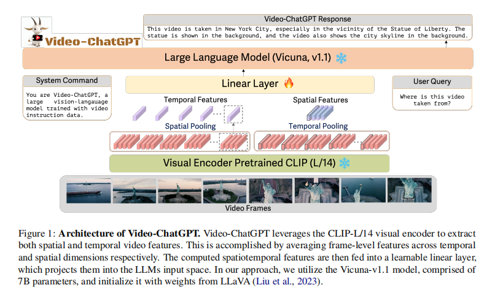
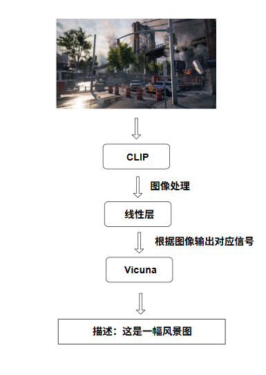

# Video-ChatGPT: Towards Detailed Video Understanding via Large Vision and Language Models

> [!warning]
> 本文只用于记录作者阅读该文献后的收获和感想，如有不当还请见谅

# 文献信息
作者: Muhammad Maaz, Hanoona Rasheed, Salman Khan, Fahad Shahbaz Khan

作者单位: Mohamed bin Zayed University of AI, UAE，Australian National University, Australia，Linköping University, Sweden

刊物: ACL 2024

主要针对的任务: 用大型视觉模型和大语言模型实现精确到帧的视频理解

解决的问题: 填补基于视频对话领域的空白

# 总览
在摘要部分，本文指出：基于视频的对话领域仍然未被充分探索，因此提出了Video-ChatGPT模型，用于填补该领域的空白

之后是对这个Video-ChatGPT模型的介绍，***Introduction*** 板块中指出，这一模型使用了适配后的一个语言模型，它集成了CLIP视觉编码器和Vicuna语言解码器，同时还对生成的指令性图像和文本进行了微调

而在 ***Video-ChatGPT*** 板块中，文章讲解了Video-ChatGPT模型的架构，原理，提示词工程

之后，文章讨论了模型训练过程中的方法，而他们训练该模型主要运用了两种方法：人工辅助标注法和半自动标注框架法

最后，文章展示了它的实验数据，并下结论；同时也举出了该模型仍然存在一些局限的地方

# 理解
## 工作原理/理论基础

在 ***Architecture*** 中，对于具有 $T$ 帧的视频样本，文章给出了这样的表达式：$V_{i} \in \mathbb{R}^{T \times H \times W \times C}$

其中，$H$ 代表每一帧图像在垂直方向上的像素数量，$W$ 则是水平方向上的像素数量，$C$ 表示通道数量（e.g. 对于一般的彩色视频，通道数为3，即红绿蓝三种颜色通道）

对于这样的样本 $V_i$，编码器会将 $T$ 帧作为一个批次的图像进行编码，产生嵌入： $x_{i} \in \mathbb{R}^{T \times h \times w \times L}$

这里，$h = \frac{H}{p}, \space w = \frac{W}{p}$，对于参数 $p$，它指的是图块的大小，对于文章使用的编码器 CLIP ViT-L/14来说，这里的 $p = 14$

之后，文章从时间和空间两个维度，推导出了视频级的维度表征，其中 $N$ 为Token数量，此时，在这个帧级嵌入中，单位的Token数量便可以表达为：$N = h \times w$

文章推导出的时间表征： $t_{i} \in \mathbb{R}^{T \times D}$

空间表征：$z_{i} \in \mathbb{R}^{N \times D}$

获得了时间表征和空间表征之后，便可以拼接他们，得到视频特征 $v_i$：

$v_{i} = [t_{i} \quad z_{i}] \in \mathbb{R}^{(T+N) \times D}$

最后，利用得到的视频特征，将其传入线性层 $g$ 中，可以得到语言嵌入Token $Q_v$: 

$Q_{v} = g(v_{i}) \in \mathbb{R}^{(T+N) \times K}$

以上，便是Video-ChatGPT的原理，利用视觉编码器对时间和空间两个不同维度的分离处理，就可以进行嵌入Token的生成

换句话说，这样一个设计架构由三部分：CLIP，线性层和Vicuna组成

其中，CLIP负责处理图像，相当于“眼睛”

线性层则是充当中间层，将CLIP处理后的画面转化为对应信号

最终，由语言模型Vicuna进行组织输出，这一输出内容基于得到的信号进行

直观地，如下图所示：

## 模型训练
训练该模型时，该研究团队建立了一个庞大的视频-指令对的数据库，并且引入了一个新的标注框架

通过这个视频-指令对的数据库，模型可以很好的完成很多既定任务，而建立这个数据库的过程，研究团队主要使用两种方法：人工辅助标注和半自动标注框架

### 人工辅助标注
运用人类标注员，对视频内容的物理外观，空间和时间进行详细的标注

### 半自动标注框架
研究团队利用密集图像视觉-语言模型的能力，开发了一个半自动的标注框架

为了确保高质量的数据，团队进行了如下步骤：

- 对现有的模型保持高预测阈值
- 设计专门的过滤机制，移除与帧级标签不匹配的字幕
- 合并帧级字幕，并使用GPT-3.5生成单一连贯的视频字幕

最后，研究团队利用GPT的辅助后处理机制，优化了标注，生成了更高质量的提示词数据

# 结论
本论文提出了新的多模态模型Video-ChatGPT，并引入了一个高效的视频-指令对的数据集和一套半自动标注机制，使得这个模型的视频理解能力得到很大的加强

但是，正如本文在 ***Limitations*** 中提到的，这个模型在理解长视频（超过2分钟的视频）时依然有缺陷

尽管如此，这一模型还是填补上了视频理解对话上的空白，为之后的研究提供了一个方法