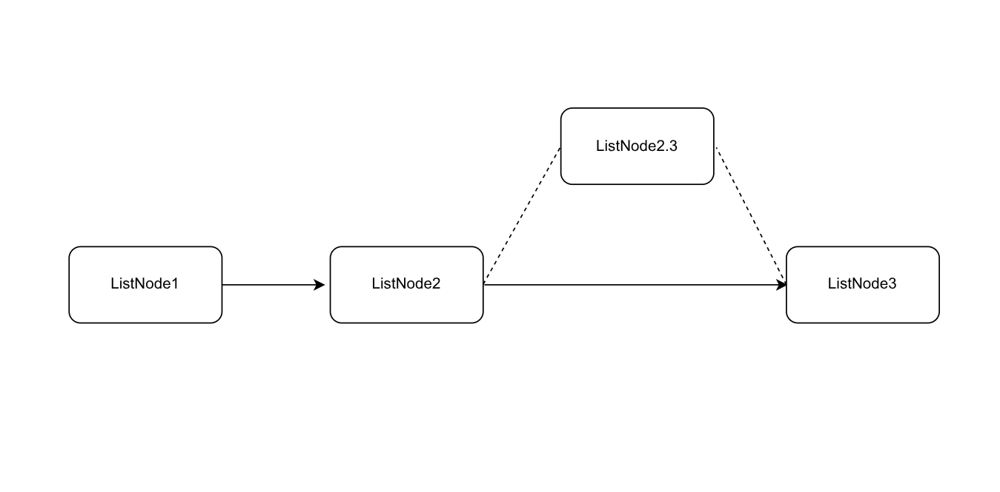

# ADT：链表
链表是表的一种，对空间的连续性没有太高的要求 
## 单链表
### 定义
单链表大概是长这个样子的：

可以预见，每一个ListNode中应该有两个基本成员：对应的value和指向下一个ListNode的指针next\
那么，定义结构：
```cpp
struct ListNode {
    int val = 0;
    ListNode* nextPtr = nullptr;
};
```
> [!WARNING]
> 未作特殊声明，本文采用的单链表将一直是按照以上定义来的
> 
这便是一个对单链表的最基本的定义
### 遍历
对于单链表，有两种遍历方式：
\
\
**1, 基于递归的方式**：
```cpp
void RecursionTraversal(ListNode head) {
    // Do something for current listnode
    if (head.nextPtr) {
        RecursionTraversal(*head.nextPtr);
    }
}
```
这种方式比较直观，写起来也比较简单 

**2, 基于循环的非递归方式**
```cpp
void WhileTraversal(ListNode head) {
    // Do something for head
    auto ptr = head.nextPtr;
    while(ptr) {
        // Do something for ptr
        ptr = ptr->nextPtr;
    }
}
```
这种方式可能不太直观，但是限定在了一个函数里面，避免了递归

**两种方式的比较**
在规模较小的数据集中，两种方法并无差别，但是当数据集大到一定程度的时候（length = 1000为测试），基于循环的方式明显比基于递归的方式快


*T1是基于递归的遍历用时，T2是基于循环的遍历用时 (单位：微秒)*

因此，两种方法中，**基于循环的方法**更加的具有效率，平常开发也会更建议使用这种方法

### 增删查改

**增**
对于增，我们使用insert函数来进行实现：
```cpp
void insert(ListNode &begin, int element) {
    auto after = begin.nextPtr;
    begin.nextPtr = new ListNode {element};
    begin.nextPtr->nextPtr = after;
}
```
上述过程更多是像这样的：


需要注意的是：我们在插入之前应该先对当前的ListNode的nextPtr进行**备份**（对应after指针）

将新的ListNode放置到begin.nextPtr之后再将之前备份的ListNode插入到新的ListNode的nextPtr上

**删**
对于删，我们使用del函数进行实现：
> [!WARNING]
> 请注意，下面的操作建立在List中的所有元素均不相同的基础上
```cpp
ListNode* del(ListNode *begin, int target) {
    if (begin->val == target) {
        // 是头部
        ListNode* temp = begin->nextPtr;
        delete begin;
        return temp;
    }
    auto prev = begin;
    auto ptr = begin->nextPtr;
    while (ptr) {
        if (ptr->val == target) {
            if (ptr->nextPtr == nullptr) {
                // 是尾节点
                delete ptr;
                return begin;
            }
            else {
                // 是中间
                prev->nextPtr = ptr->nextPtr;
                delete ptr;
                return begin;
            }
        }
        prev = ptr;
        ptr = ptr->nextPtr;
    }

    return begin;
}
```
可能实现有点冗余，后续会进行一定的改进

整个过程类似于这样：


对于删，我们要进行三个判断：判断删的是头，中间还是尾部；做了这些判断，剩下的就简单了很多

**查, 改**

这两种操作基于遍历，对于所需要的元素进行find并返回true或者false，若有需要对其进行修改即可，不多赘述

## 双链表

双链表相对于单链表的特殊之处就是多了一个指向前面一个ListNode的指针prev,所以双链表的定义如下：
```cpp
struct ListNode {
    int val = 0;
    ListNode* nextPtr = nullptr;
    ListNode* prevPtr = nullptr;
};
```
这样的定义的好处就是对应的增删查改操作方便了很多，尤其是对于删，不需要再额外定义一个prev指针

## 关于循环链表
有时候会需要判断一个链表是不是循环链表，通常使用快慢指针法：
```cpp
bool isCircle_fsPtr(ListNode head) {
    auto fast_ptr = &head;
    auto slow_ptr = &head;
    while (fast_ptr && fast_ptr->nextPtr) {
        fast_ptr = fast_ptr->nextPtr->nextPtr;
        slow_ptr = slow_ptr->nextPtr;

        if (fast_ptr == slow_ptr) return true;
    }
    return false;
}
```
类似于转圈，一个快一个慢，当二者相遇的时候就意味着这个链表是一个环（类比时钟上的分针和时针）